# JAVA基础部分

## JVM

### JVM的内存结构

​	JVM的内存结构一共分为5大内容，分别是**程序计数器**、**JAVA虚拟机栈**、**方法区**、**堆**、**本地方法栈**。 其关系如下图所示。


#### 程序计数器

​	程序计数器使用了一块较小的空间，主要是指向当前线程的所执行的字节码型号的指示器。字节码解释器工作就是通过改变这个计数器的值来选取下一条执行的字节码指令。程序分支、循环、跳转、异常处理都需要依赖与程序计数器。**此内存区域是唯一一个在java虚拟机规范中没有规定任何OutOfMemoryError情况的区域**

> 自我理解：程序计数器类似与一个管理员或者协调者，所有的事情都归他记录下来，下面的人执行什么由他来进行统一的调配和协调。这样就能让底下的人有条不紊的干活。

​	程序计数器是一个线程私有的内容。主要原因是CPU的切换不同的线程，在切换后需要知道上次执行的位置，所以每个线程必须私有化。

#### JAVA虚拟机栈

​	JAVA虚拟机栈是为了存储当前线程运行方法所需要的局部变量、指令、返回值、返回地址等信息。在每个方法执行的时候，虚拟机都会创建一个栈帧（Stack Frame）存储当前线程运行方法时所需要的数据、指令、返回地址。在每个方法执行时，虚拟机栈都会创建一个栈帧（Stack Frame），用于存储：局部变量表、操作数栈、动态链接、方法出口等信息。

​	局部变量表存放了编译器可知的各种基本数据类型（boolean、byte、char、short、int、float、long、double）、对象引用(reference类型，它不等同与对象本身，可能是一个指向对象其实地址的引用指针，也可能是指向一个代表对象的句柄或其他与此对象相关的位置) 和returnAddress类型（指向了一条字节码指令的地址）Java虚拟机

> 栈可能出现两种类型的异常：
>
> 1. 线程请求的栈深度大于虚拟机允许的栈深度，将抛出StackOverflowError。
> 2. 虚拟机栈空间可以动态扩展，当动态扩展无法申请到足够空间时，抛出OutOfMemory异常。

#### 本地方法栈

​	本地方法栈和JAVA虚拟机栈很相似，都叫栈，其区别有以下几点：

- java虚拟机栈为虚拟机执行java方法（也就是字节码）服务
- 本地方法栈为虚拟机使用到的Native方法服务

#### 方法区

​	方法区是用于区分堆的内容，也被称为非堆。用于存储已被虚拟机加载的类信息、常量、静态变量，如static修饰的变量加载类的时候就被加载到方法区中。

> 在老版jdk，方法区也被称为永久代【因为没有强制要求方法区必须实现垃圾回收，HotSpot虚拟机以永久代来实现方法区，从而JVM的垃圾收集器可以像管理堆区一样管理这部分区域，从而不需要专门为这部分设计垃圾回收机制。不过自从JDK7之后，Hotspot虚拟机便将运行时常量池从永久代移除了。】

``` java
jdk1.7开始逐步去永久代。从String.interns()方法可以看出来
String.interns()
native方法:作用是如果字符串常量池已经包含一个等于这个String对象的字符串，则返回代表池中的这个字符串的String对象，在jdk1.6及以前常量池分配在永久代中。可通过 -XX:PermSize和-XX:MaxPermSize限制方法区大小。
jdk8真正开始废弃永久代，而使用元空间(Metaspace)
```

```java
public class StringIntern {
    //运行如下代码探究运行时常量池的位置
    public static void main(String[] args) throws Throwable {
        //用list保持着引用 防止full gc回收常量池
        List<String> list = new ArrayList<String>();
        int i = 0;
        while(true){
            list.add(String.valueOf(i++).intern());
        }
    }
}
//如果在jdk1.6环境下运行 同时限制方法区大小 将报OOM后面跟着PermGen space说明方法区OOM，即常量池在永久代
//如果是jdk1.7或1.8环境下运行 同时限制堆的大小  将报heap space 即常量池在堆中
```

> 思考一下，为什么使用元空间替换永久代？
>
> 表面上看是为了避免OOM异常。因为通常使用`PermSize`和`MaxPermSize`设置永久代的大小就决定了永久代的上限，但是不是总能知道应该设置为多大合适, 如果使用默认值很容易遇到OOM错误。当使用元空间时，可以加载多少类的元数据就不再由`MaxPermSize`控制, 而由系统的实际可用空间来控制。更深层的原因还是要合并`HotSpot`和`JRockit`的代码，`JRockit`从来没有所谓的永久代，也不需要开发运维人员设置永久代的大小，但是运行良好。同时也不用担心运行性能问题了,在覆盖到的测试中, 程序启动和运行速度降低不超过1%，但是这点性能损失换来了更大的安全保障。

#### 堆


​	堆作为JVM中最大的一块内存。**java堆是被所有线程共享的一块内存区域**，堆的唯一目的就是存放实例对象，几乎所有的对象实例都在这里分配内存。它被划分为了两个不同区域：新生代(Young)、老年代(Old)。

> 注意：老年代不是永久代。之前我一直搞错，把老年代和永久代混为一谈，真正梳理之后才发现连基本概念都错了，上文提到了永久代是方法区的内容，而老年代是存放在堆中的信息。

​	新生代 ( Young ) 又被划分为三个区域：Eden、From Survivor、To Survivor。

> 为什么需要两个survivor区域？
>
> 首先要知道Survivor的存在意义
>
> **Survivor的存在意义，就是减少被送到老年代的对象，进而减少Full GC的发生，Survivor的预筛选保证，只有经历16次Minor GC还能在新生代中存活的对象，才会被送到老年代。**
>
> survivor区域是Eden区和Old区的一个过渡。对象首先在Eden区，YoungGC的时候，部分对象会被放在Servivor区，而servivor只会有一个区域被复制，这样可以减少碎片化，让servivor区会更快的复制到Old区。其基本流程是Eden和一个Servivor区回收到另一个Servivor区，然后再送到Old区。

​	java堆可以处于物理上不连续的内存空间中，只要逻辑上是连续的即可，就像我们磁盘空间一样。（不过在实现中既可以大小固定，也可以是可扩展，通过`-Xmx`和`-Xms`控制），**如果在堆中没有内存完成实例分配，并且堆也无法再扩展时**，将会抛出OutOfMemoryError异常。

###  垃圾回收机制

#### JVM视为“垃圾”的数据

​	之前看到了JVM的内存模型，我们看到程序计数器，JAVA方法栈和本地方法栈是在线程中的，随着线程的创建而创建，线程的销毁而销毁。这样的话，这些数据很可能就是朝生夕死。而且每个线程独有。这块内容就不是考虑的主要内容。真正要考虑的是公用部分，是堆和非堆(也就是方法区)。这部分的内容是大家共享的，但是用完了并不会告知要进行清理，这个时候就需要垃圾回收机制来保证他们的清理工作。

#### 垃圾判断算法

##### 引用计数法

​	引用计数法就是给对象中添加一个引用计数器，每当有一个地方引用它，计数器就加 1；当引用失效，计数器就减 1；任何时候计数器为 0 的对象就是不可能再被使用的，可以当做垃圾收集。这种方法实现起来很简单而且优缺点都很明显。

- **优点 执行效率高，程序执行受影响较小**
- **缺点 无法检测出循环引用的情况，导致内存泄露**

##### 可达性分析算法

​	可达性分析基本思路是把所有引用的对象想象成一棵树，从树的根结点 GC Roots 出发，持续遍历找出所有连接的树枝对象，这些对象则被称为“可达”对象，或称“存活”对象。不能到达的则被可回收对象。

下面这张图就是可达性分析的描述：


#### 垃圾回收算法

##### 标记－清理

​	第一步（标记），利用可达性遍历内存，把“存活”对象和“垃圾”对象进行标记。

​	第二步（清理），我们再遍历一遍，把所有“垃圾”对象所占的空间直接 清空 即可。

​	特点为：

- 简单方便
- 容易产生内存碎片

##### 标记－整理

​	第一步（标记）：利用可达性遍历内存，把“存活”对象和“垃圾”对象进行标记。

​	第二步（整理）：把所有存活对象堆到同一个地方，这样就没有内存碎片了。

​	特点为：

- 适合存活对象多，垃圾少的情况
- 需要整理的过程

##### 复制

​	将内存按照容量划分为大小相等的两块，每次只使用其中的一块。当这一块用完了，就将还活着的对象复制到另一块上，然后再把使用过的内存空间一次性清理掉。

​	特点为：

- 只能使用一半的空间
- 简单
- 不会产生碎片

#### 方法区的垃圾回收

​	方法区又叫做永久代。永久代的垃圾回收主要有两部分：废弃常量和无用的类。

​	首先是废弃常量垃圾回收的一般步骤：

​	第一步：判定一个常量是否是废弃常量：没有任何一个地方对这个常量进行引用就表示是废弃常量。

​	第二步：垃圾回收

​	然后是无用的类垃圾回收的一般步骤：判定一个类是否是“无用的类”：需要满足下面三个条件:

1. 该类所有的实例都已经被回收,也就是Java堆中不存在该类的任何实例。
2. 加载该类的ClassLoader已经被回收。
3. 该类对应的java.lang.Class对象没有在任何地方被引用,无法在任何地方通过反射访问该类的方法。

#### 堆的垃圾回收

​	因为堆被划分成了Young区和Old区，所以堆的垃圾回收也是分代进行回收的。Young区的特点是：存活对象少，垃圾多。而Old区正好相反：存活对象多，垃圾少。所以对这两个需要单独讨论

##### Young区的回收

​	Young区采用的`复制回收`算法，GC 时把少量的存活对象复制过去即可。但是从上面我们可以看到，新生代也划分了三个部分比例：Eden：S1：S2=8:1:1。

​	工作原理如下：

1. 首先，Eden对外提供堆内存。当 Eden区快要满了，触发垃圾回收机制，把存活对象放入 Survivor A 区，清空 Eden 区；
2. Eden区被清空后，继续对外提供堆内存；
3. 当 Eden 区再次被填满，对 Eden区和 Survivor A 区同时进行垃圾回收，把存活对象放入 Survivor B区，同时清空 Eden 区和Survivor A 区；
4. 当某个 Survivor区被填满，把多余对象放到Old 区；
5. 当 Old 区也被填满时，进行 下一阶段的垃圾回收。

##### Old区的回收

​	根据老年代的特点，这里仅仅通过少量地移动对象就能清理垃圾，而且不存在内存碎片化。也就是标记整理的回收机制。所以Old区采用的是`标记-整理`算法。

### 垃圾回收器

​	如果说收集算法是内存回收的方法论，那么垃圾收集器就是内存回收的具体实现。在了解垃圾回收器之前，首先得了解一下垃圾回收器的几个名词。

1. 吞吐量

   CPU用于运行用户代码的时间与CPU总消耗时间的比值。比如说虚拟机总运行了100 分钟，用户代码时间 99 分钟，垃圾回收时间1分钟，那么吞吐量就是99%。

2. 停顿时间

   停顿时间指垃圾回收器正在运行时，应用程序的暂停时间。

3. GC的名词

   新生代GC：Minor GC

   老年代GC：Major GC

4. 并发与并行

   1. 串行（Parallel）

      垃圾回收线程 进行垃圾回收工作，但此时 用户线程仍然处于等待状态。

   2. 并发（Concurrent）

      这里的并发指 用户线程 与 垃圾回收线程 交替执行。

   3. 并行（Parallel）

      这里的并行指 用户线程 和多条 垃圾回收线程 分别在不同 CPU 上同时工作。
      
#### Serial

​	最基本、发展最久的收集器，在jdk3以前是gc收集器的唯一选择。采用的是`复制算法`。垃圾清理时，Serial收集器只能使用一条线程进行收集工作，在收集的时候必须得停掉其它线程，等待收集工作完成其它线程才可以继续工作。所以Serial回收器不存在线程间的切换，因此，在单CPU的环境下，垃圾清除效率比较高。

> ​	优点：对于Client模式下的jvm来说是个好的选择。适用于单核CPU【现在基本都是多核了】
> ​	缺点：收集时要暂停其它线程，有点浪费资源，多核下显得。

#### ParNew

   ParNew回收器是在Serial回收器的基础上演化而来的，属于Serial回收器的多线程版本，采用`复制算法`。运行在新生代区域。在实现上，两者共用很多代码。在不同运行环境下，根据CPU核数，开启不同的线程数，从而达到最优的垃圾回收效果。

> 优点:
> 1.支持多线程，多核CPU下可以充分的利用CPU资源
> 2.运行在Server模式下新生代首选的收集器【重点是因为新生代的这几个收集器只有它和Serial可以配合CMS收集器一起使用】
>
> 缺点: 在单核下表现不会比Serial好，由于在单核能利用多核的优势，在线程收集过程中可能会出现频繁上下文切换，导致额外的开销。

#### Parallel Scavenge

​	采用`复制算法`的收集器，和ParNew一样支持多线程。

​	但是该收集器重点关心的是吞吐量【吞吐量 = 代码运行时间 / (代码运行时间 + 垃圾收集时间)  如果代码运行100min垃圾收集1min，则为99%】对于用户界面，适合使用GC停顿时间短,不然因为卡顿导致交互界面卡顿将很影响用户体验。

​	对于后台

​	高吞吐量可以高效率的利用cpu尽快完成程序运算任务，适合后台运算

> Parallel Scavenge注重吞吐量，所以也成为"吞吐量优先"收集器。

#### Serial Old

​	和新生代的Serial一样为单线程，Serial的老年代版本，不过它采用"标记-整理算法"，这个模式主要是给Client模式下的JVM使用。如果是Server模式有两大用途

1. jdk5前和Parallel Scavenge搭配使用，jdk5前也只有这个老年代收集器可以和它搭配。

2. 作为CMS收集器的后备。

#### Parallel Old

   支持多线程，Parallel Scavenge的老年版本，jdk6开始出现， 采用"标记-整理算法"【老年代的收集器大都采用此算法】

   在jdk6以前，新生代的Parallel Scavenge只能和Serial Old配合使用【根据图，没有这个的话只剩Serial Old，而Parallel Scavenge又不能和CMS配合使用】，而且Serial Old为单线程Server模式下会拖后腿【多核cpu下无法充分利用】，这种结合并不能让应用的吞吐量最大化。

> Parallel Old的出现结合Parallel Scavenge，真正的形成“吞吐量优先”的收集器组合。
>

#### CMS

​	CMS收集器(Concurrent Mark Sweep)是以一种获取最短回收停顿时间为目标的收集器。【重视响应，可以带来好的用户体验，被sun称为并发低停顿收集器】。CMS采用的是"标记-清除"(Mark Sweep)算法，而且是支持并发(Concurrent)的

​	它的运作分为4个阶段

> 1.初始标记:标记一下GC Roots能直接关联到的对象，速度很快
> 2.并发标记:GC Roots Tarcing过程，即可达性分析
> 3.重新标记:为了修正因并发标记期间用户程序运作而产生变动的那一部分对象的标记记录，会有些许停顿，时间上一般 初始  标记 < 重新标记 < 并发标记
> 4.并发清除

​	以上初始标记和重新标记需要stw(停掉其它运行java线程)，之所以说CMS的用户体验好，是因为CMS收集器的内存回收工作是可以和用户线程一起并发执行。

​	总体上CMS是款优秀的收集器，但是它也有些缺点。

> 1.cms堆cpu特别敏感，cms运行线程和应用程序并发执行需要多核cpu，如果cpu核数多的话可以发挥它并发执行的优势，但是cms默认配置启动的时候垃圾线程数为 (cpu数量+3)/4，它的性能很容易受cpu核数影响，当cpu的数目少的时候比如说为为2核，如果这个时候cpu运算压力比较大，还要分一半给cms运作，这可能会很大程度的影响到计算机性能。
>
> 2.cms无法处理浮动垃圾，可能导致Concurrent Mode Failure（并发模式故障）而触发full GC
>
> 3.由于cms是采用"标记-清除“算法,因此就会存在垃圾碎片的问题，为了解决这个问题cms提供了 **-XX:+UseCMSCompactAtFullCollection**选项，这个选项相当于一个开关【默认开启】，用于CMS顶不住要进行full GC时开启内存碎片合并，内存整理的过程是无法并发的，且开启这个选项会影响性能(比如停顿时间变长)

#### G1收集器

​	G1(garbage first:尽可能多收垃圾，避免full gc)收集器是当前最为前沿的收集器之一(1.7以后才开始有)，同cms一样也是关注降低延迟，是用于替代cms功能更为强大的新型收集器，因为它解决了cms产生空间碎片等一系列缺陷。适用于 Java HotSpot VM 的低暂停、服务器风格的分代式垃圾回收器。G1 GC 使用并发和并行阶段实现其目标暂停时间，并保持良好的吞吐量。当 G1 GC 确定有必要进行垃圾回收时，它会先收集存活数据最少的区域（垃圾优先)，g1的特别之处在于它强化了分区，弱化了分代的概念，是区域化、增量式的收集器，它不属于新生代也不属于老年代收集器。用到的算法为标记-清理、复制算法。

​	g1通过并发(并行)标记阶段查找老年代存活对象，通过并行复制压缩存活对象【这样可以省出连续空间供大对象使用】。g1将一组或多组区域中存活对象以增量并行的方式复制到不同区域进行压缩，从而减少堆碎片，目标是尽可能多回收堆空间【垃圾优先】，且尽可能不超出暂停目标以达到低延迟的目的。g1提供三种垃圾回收模式 young gc、mixed gc 和 full gc,不像其它的收集器，根据区域而不是分代，新生代老年代的对象它都能回收。

下面其中垃圾回收器是基于HotSpot虚拟机。

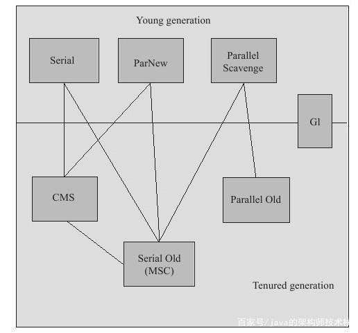

## JAVA 集合

​	java集合是我们经常需要用到一个辅助工具，深入的了解集合以及集合的用法可以更快的帮助我们编写程序，编写效率更高，性能更好的程序。深入的理解JAVA集合是很有必要的一件事情。

> 数组和集合的比较
>
> ​	数组不是面向对象的，存在明显的缺陷，集合弥补了数组的缺点，比数组更灵活更实用，而且不同的集合框架类可适用不同场合。如下：
>
> 1. 数组能存放基本数据类型和对象，而集合类存放的都是对象，集合类不能存放基本数据类型。数组和集合存放的对象皆为对象的引用地址。
> 2. 数组容易固定无法动态改变，集合类容量动态改变。
> 3. 数组无法判断其中实际存有多少元素，length只告诉了数组的容量，而集合的size()可以确切知道元素的个数
> 4. 集合有多种实现方式和不同适用场合，不像数组仅采用顺序表方式
> 5. 集合以类的形式存在，具有封装、继承、多态等类的特性，通过简单的方法和属性即可实现各种复杂操作，大大提高了软件的开发效率

​	JAVA的集合框架由两大家族组成。分别是**Collection**家族和**Map**家族。下图展示了集合的框架结构。

​	

### Collection

​	Java标准库自带的`java.util`包提供了集合类：`Collection`，它是除`Map`外所有其他集合类的根接口。Java的`java.util`包主要提供了以下三种类型的集合：

- `List`：一种排列有序、可以重发的的集合；
- `Set`：一种无序，但保证没有重复元素的集合；
- `Queue`：一种先进先出、排列有序的，可以重复的队列集合。

```java
public interface Collection<E> extends Iterable<E> {
    //获取集合中的数量，如果超过了Integer.MAX_VALUE，则返回Integer.MAX_VALUE
    int size();
	//集合为空则返回true
    boolean isEmpty();
	//判断集合是否包含了元素，包含返回true
    boolean contains(Object var1);
	//返回一个迭代器
    Iterator<E> iterator();
	//返回一个顺序性对象数组
    Object[] toArray();
	//返回一个指定类型的数组
    <T> T[] toArray(T[] var1);
	//在List结尾添加一个元素
    boolean add(E var1);
	//移除第一个匹配的元素
    boolean remove(Object var1);
	//判断是否包含了集合内的全部元素
    boolean containsAll(Collection<?> var1);
	//添加集合内所有元素
    boolean addAll(Collection<? extends E> var1);
	//移除参数中集合内的匹配到的所有元素
    boolean removeAll(Collection<?> var1);
	//Lambda表达式的过滤器，匹配到了过滤器则移除
    default boolean removeIf(Predicate<? super E> var1) {
        Objects.requireNonNull(var1);
        boolean var2 = false;
        Iterator var3 = this.iterator();

        while(var3.hasNext()) {
            if (var1.test(var3.next())) {
                var3.remove();
                var2 = true;
            }
        }

        return var2;
    }
	//只保留匹配到参数中的集合元素
    boolean retainAll(Collection<?> var1);
	//清空集合
    void clear();
	//equals方法
    boolean equals(Object var1);
	//hashCode方法
    int hashCode();
	//返回分割器
    default Spliterator<E> spliterator() {
        return Spliterators.spliterator(this, 0);
    }
	//返回流，配合分割器做迭代用
    default Stream<E> stream() {
        return StreamSupport.stream(this.spliterator(), false);
    }
	//返回并发流，配合分割器做迭代用
    default Stream<E> parallelStream() {
        return StreamSupport.stream(this.spliterator(), true);
    }
}

```


#### List

​	List集合为列表类型，以线性方式存储对象。List集合中的元素允许重复，各元素的顺序就是对象插入的顺序。用户可以通过使用**索引**来访问List集合中的元素。**List集合的特点就是存取有序，可以存储重复的元素，可以用下标进行元素的操作。**

​	List中几个重要的方法

| 方法                                      | 说明                                                         |
| ----------------------------------------- | ------------------------------------------------------------ |
| void add（int index，Object obj）         | 将obj插入调用列表，插入位置的下标由index传递。任何已存在的，在插入点以及插入点以后的元素将前移，因此没有元素被覆写。 |
| Boolean addAll（int index，Collection c） | 将c中的所有元素插入到调用列表中，插入点的下标由index传递。   |
| Object get（int index）                   | 返回指定下标的对象                                           |
| Object set（int index，Object obj）       | 对由index指定的位置进行赋值                                  |
| int indexOf（Object obj）                 | 返回调用列表obj的第一个实例的下标。如果obj不是列表元素，返回-1. |

##### ArrayList

​	ArrayList支持可随需要而增长的动态数组。在Java数组中，长度是固定的，因此在数组被创建后，不能修改长度，这意味着开发者需要实现知道数组的长度。但在一般情况下，只有在运行时才知道数组长度。为了解决这个问题，ArrayList因此而生。下面分析以下ArrayList的几个重点方法。

1. 构造方法

```java 
//继承了AbstractList，实现了List接口，RandomAccess随机访问接口，Cloneable接口，序列化接口
public class ArrayList<E> extends AbstractList<E>
        implements List<E>, RandomAccess, Cloneable, java.io.Serializable{
    //指定大小构造一个ArrayList的内部数组
    public ArrayList(int var1) {
        if (var1 > 0) {
            this.elementData = new Object[var1];
        } else {
            if (var1 != 0) {
                throw new IllegalArgumentException("Illegal Capacity: " + var1);
            }
            this.elementData = EMPTY_ELEMENTDATA;
        }
    }
    //按照默认容量来构造一个数组，默认大小为10
    public ArrayList() {
        this.elementData = DEFAULTCAPACITY_EMPTY_ELEMENTDATA;
    }
    //根据集合来构造一个ArrayList数组
    public ArrayList(Collection<? extends E> var1) {
        this.elementData = var1.toArray();
        if ((this.size = this.elementData.length) != 0) {
            if (this.elementData.getClass() != Object[].class) {
                this.elementData = Arrays.copyOf(this.elementData, this.size, Object[].class);
            }
        } else {
            //集合元素为空则创建默认容量为10的数组
            this.elementData = EMPTY_ELEMENTDATA;
        }
    }
｝
```

2. 新增操作

```java
//新增一个元素
public boolean add(E var1) {
    this.ensureCapacityInternal(this.size + 1);
    this.elementData[this.size++] = var1;
    return true;
}
//在指定位置新增
public void add(int var1, E var2) {
    this.rangeCheckForAdd(var1);
    this.ensureCapacityInternal(this.size + 1);
    System.arraycopy(this.elementData, var1, this.elementData, var1 + 1, this.size - var1);
    this.elementData[var1] = var2;
    ++this.size;
}
//确保容量，不够需要扩容
private void ensureCapacityInternal(int var1) {
    this.ensureExplicitCapacity(calculateCapacity(this.elementData, var1));
}
//确保容量，不够需要扩容
private void ensureExplicitCapacity(int var1) {
    //修改次数+1
    ++this.modCount;
    if (var1 - this.elementData.length > 0) {
        this.grow(var1);
    }
}
//扩容函数
private void grow(int var1) {
    int var2 = this.elementData.length;
    //默认扩容原容量的一半
    int var3 = var2 + (var2 >> 1);
    if (var3 - var1 < 0) {
        var3 = var1;
    }
    if (var3 - 2147483639 > 0) {
        var3 = hugeCapacity(var1);
    }
    this.elementData = Arrays.copyOf(this.elementData, var3);
}
```

```java
/**
 *
 * @param  src      the source array. 来源数组
 * @param  srcPos   starting position in the source array. 从来源数组开始拷贝的位置
 * @param  dest     the destination array.	目标数组
 * @param  destPos  starting position in the destination data.	目标数组开始的位置
 * @param  length   the number of array elements to be copied. 需要拷贝的来源的位置
 */
public static native void arraycopy(Object src,  int  srcPos, Object dest, int destPos, int length);
```

> copy数组可以使用`System.arraycopy`和`Arrays.copyOf`方法，`System.arraycopy`是`native`方法，而`Arrays`是一个工具类，在调用`copyOf`的时候，实际也还是调用了`System.arraycopy`，只是包装了一下，使用起来更加的简单和方便。

3. 删除操作
```java 
public E remove(int index) {
    rangeCheck(index);
    modCount++;
    //获取需要移除的元素
    E oldValue = elementData(index);
    int numMoved = size - index - 1;
    if (numMoved > 0)
        System.arraycopy(elementData, index+1, elementData, index,
                         numMoved);
    elementData[--size] = null; // clear to let GC do its work
    return oldValue;
}
public boolean remove(Object o) {
    if (o == null) {
        for (int index = 0; index < size; index++)
            if (elementData[index] == null) {
                fastRemove(index);
                return true;
            }
    } else {
        for (int index = 0; index < size; index++)
            if (o.equals(elementData[index])) {
                fastRemove(index);
                return true;
            }
    }
    return false;
}
private void fastRemove(int index) {
    modCount++;
    int numMoved = size - index - 1;
    if (numMoved > 0)
        System.arraycopy(elementData, index+1, elementData, index,
                         numMoved);
    elementData[--size] = null; // clear to let GC do its work
}
```

4. 更改操作

```java
public E set(int index, E element) {
    rangeCheck(index);
	//获取旧的值
    E oldValue = elementData(index);
    //赋值新值
    elementData[index] = element;
    return oldValue;
}
//校验长度范围
private void rangeCheck(int index) {
    if (index >= size)
        throw new IndexOutOfBoundsException(outOfBoundsMsg(index));
}
```

5. 查找操作

```java
public E get(int index) {
    rangeCheck(index);
    //直接返回位置的元素
    return elementData(index);
}
```

6. 总结

- ArrayList自己实现了序列化和反序列化的方法
- ArrayList基于数组方式实现，无容量的限制（会扩容）。添加元素时可能要扩容（所以最好预判一下），删除元素时不会减少容量（若希望减少容量，trimToSize()），删除元素时，将删除掉的位置元素置为null，下次gc就会回收这些元素所占的内存空间。
- 线程不安全，会出现fall-fail。
- add(int index, E element)：添加元素到数组中指定位置的时候，需要将该位置及其后边所有的元素都整块向后复制一位
- get(int index)：获取指定位置上的元素时，可以通过索引直接获取（O(1)）
- remove(Object o)需要遍历数组
- remove(int index)不需要遍历数组，只需判断index是否符合条件即可，效率比remove(Object o)高
- contains(E)需要遍历数组
- 使用iterator遍历可能会引发多线程异常

##### LinkedList

​	LinkedList基于链表实现的，从源码可以看出是一个双向链表。双向链表适用于增删频繁且查询不频繁的场景，线程不安全的且适用于单线程（这点和ArrayList很像）。直接父类是AbstractSequentialList，不实现RandomAccess接口，不支持随机访问。AbstractSequentialList这个抽象类实现了最基本的顺序访问功能，虽然支持随机访问的也支持顺序访问，但是一般设计上还是会把它们两个当成无关联的两个特性。所以当利用随机访问特性时优先extends AbstractList而不是此类，当然实现此类也可以，只是没必要。

1. 构造方法

```java
//特别注意这个继承的是AbstractSequentialList，它没有实现RandomAccess接口
public class LinkedList<E>
    extends AbstractSequentialList<E>
    implements List<E>, Deque<E>, Cloneable, java.io.Serializable {
	
    public LinkedList() {
    }

    //根据集合构造
    public LinkedList(Collection<? extends E> c) {
        this();
        addAll(c);
    }
｝
```

2. 新增操作

```java
//默认在最尾端新增一个Node节点，即添加元素
public boolean add(E e) {
    linkLast(e);
    return true;
}
void linkLast(E e) {
    final Node<E> l = last;
    final Node<E> newNode = new Node<>(l, e, null);
    last = newNode;
    if (l == null)
        first = newNode;
    else
        l.next = newNode;
    size++;
    modCount++;
}
```

3. 删除操作

```java
public E remove(int index) {
    checkElementIndex(index);
    return unlink(node(index));
}
private void checkElementIndex(int index) {
    if (!isElementIndex(index))
        throw new IndexOutOfBoundsException(outOfBoundsMsg(index));
}
//解掉关联信息，名字也可以看出来，unlink
E unlink(Node<E> x) {
    // assert x != null;
    final E element = x.item;
    final Node<E> next = x.next;
    final Node<E> prev = x.prev;

    if (prev == null) {
        first = next;
    } else {
        prev.next = next;
        x.prev = null;
    }

    if (next == null) {
        last = prev;
    } else {
        next.prev = prev;
        x.next = null;
    }

    x.item = null;
    size--;
    modCount++;
    return element;
}
```

4. 更改操作

```java
public E set(int index, E element) {
    checkElementIndex(index);
    Node<E> x = node(index);
    E oldVal = x.item;
    x.item = element;
    return oldVal;
}
```

5. 查找操作

```java
public E get(int index) {
    checkElementIndex(index);
    return node(index).item;
}
//2分法进行查找
Node<E> node(int index) {
    // assert isElementIndex(index);
    if (index < (size >> 1)) {
        Node<E> x = first;
        for (int i = 0; i < index; i++)
            x = x.next;
        return x;
    } else {
        Node<E> x = last;
        for (int i = size - 1; i > index; i--)
            x = x.prev;
        return x;
    }
}
```

6. 总结

- LinkedList 是双向列表，链表批量增加，是靠for循环遍历原数组，依次执行插入节点操作。
- ArrayList基于数组， LinkedList基于双向链表，对于随机访问， ArrayList比较占优势，但LinkedList插入、删除元素比较快，因为只要调整指针的指向。针对特定位置需要遍历时，所以LinkedList在随机访问元素的话比较慢。
- LinkedList没有实现自己的 Iterator，使用的是 ListIterator。
- LinkedList需要更多的内存，因为 ArrayList的每个索引的位置是实际的数据，而 LinkedList中的每个节点中存储的是实际的数据和前后节点的位置。
- LinkedList也是非线程安全的，只有在单线程下才可以使用。为了防止非同步访问，Collections类里面提供了synchronizedList()方法。

#####  Vector

​	Vector 是**矢量队列**，它是JDK1.0版本添加的类。继承于AbstractList，实现了List, RandomAccess, Cloneable这些接口。

​	Vector 继承了AbstractList，实现了List；所以，**它是一个队列，支持相关的添加、删除、修改、遍历等功能**。

​	Vector 实现了RandmoAccess接口，即**提供了随机访问功能**。RandmoAccess是java中用来被List实现，为List提供快速访问功能的。在Vector中，我们即可以通过元素的序号快速获取元素对象；这就是快速随机访问。

​	Vector 实现了Cloneable接口，即实现clone()函数。它能被克隆。

​	和ArrayList不同，**Vector中的操作是线程安全的**。  

​	总结：和ArrayList差不多，但是它是线程安全的。

#### Set

​	Set:注重独一无二的性质,该体系集合可以知道某物是否已近存在于集合中,不会存储重复的元素用于存储无序(存入和取出的顺序不一定相同)元素，值不能重复。

对象的相等性

​	引用到堆上同一个对象的两个引用是相等的。如果对两个引用调用hashCode方法，会得到相同的结果，如果对象所属的类没有覆盖Object的hashCode方法的话，hashCode会返回每个对象特有的序号（java是依据对象的内存地址计算出的此序号），所以两个不同的对象的hashCode值是不可能相等的。如果想要让两个不同的Person对象视为相等的，就必须覆盖Object继下来的hashCode方法和equals方法，因为Object hashCode方法返回的是该对象的内存地址，所以必须重写hashCode方法，才能保证两个不同的对象具有相同的hashCode，同时也需要两个不同对象比较equals方法会返回true

​	该集合中没有特有的方法，直接继承自Collection。

​	其源码为包含了一个`HashMap`,下文会对`HashMap`进行分析，这里不作更多解释。

### Map

​	Map与List和Set接口不同，它是由键值对组成的集合，提供了Key-value的映射，同时他不继承Collection，保证key-value的一一对应，他不存在相同的key值，但是value值可以相同。

```java
package java.util;

import java.io.Serializable;
import java.util.function.BiConsumer;
import java.util.function.BiFunction;
import java.util.function.Function;

public interface Map<K, V> {
    //返回key-value对的数量，如果超过了Integer.MAX_VALUE则返回Integer.MAX_VALUE
    int size();
	//判断Map是否为空，为空返回true
    boolean isEmpty();
	//判断是否包含了key值
    boolean containsKey(Object var1);
	//判断是否包含了value值
    boolean containsValue(Object var1);
	//通过key获取value值
    V get(Object var1);
	//放入key-value对，如果key是存在的，返回之前老的值，否则返回空
    V put(K var1, V var2);
	//根据key移除key-value对，如果key是存在的，返回之前老的值，否则返回空
    V remove(Object var1);
	//批量插入集合
    void putAll(Map<? extends K, ? extends V> var1);
	//清理集合
    void clear();
	//返回key的集合，因为key是不能重复的，所以采用的是Set
    Set<K> keySet();
	//返回value的集合
    Collection<V> values();
	//返回key-value键值对集合
    Set<Map.Entry<K, V>> entrySet();
	//equals方法
    boolean equals(Object var1);
	//hashCode方法
    int hashCode();
	//获取key的值，如果没有，返回传入的value值
    default V getOrDefault(Object var1, V var2) {
        Object var3;
        return (var3 = this.get(var1)) == null && !this.containsKey(var1) ? var2 : var3;
    }
	//根据Lambda表达式的循环处理
    default void forEach(BiConsumer<? super K, ? super V> var1) {
        Objects.requireNonNull(var1);

        Object var4;
        Object var5;
        for(Iterator var2 = this.entrySet().iterator(); var2.hasNext(); var1.accept(var4, var5)) {
            Map.Entry var3 = (Map.Entry)var2.next();

            try {
                var4 = var3.getKey();
                var5 = var3.getValue();
            } catch (IllegalStateException var7) {
                throw new ConcurrentModificationException(var7);
            }
        }

    }
	//根据Lambda表达式的replaceAll
    default void replaceAll(BiFunction<? super K, ? super V, ? extends V> var1) {
        Objects.requireNonNull(var1);
        Iterator var2 = this.entrySet().iterator();

        while(var2.hasNext()) {
            Map.Entry var3 = (Map.Entry)var2.next();

            Object var4;
            Object var5;
            try {
                var4 = var3.getKey();
                var5 = var3.getValue();
            } catch (IllegalStateException var8) {
                throw new ConcurrentModificationException(var8);
            }

            var5 = var1.apply(var4, var5);

            try {
                var3.setValue(var5);
            } catch (IllegalStateException var7) {
                throw new ConcurrentModificationException(var7);
            }
        }

    }
	//如果key不存在则put,否则就返回以前的值
    default V putIfAbsent(K var1, V var2) {
        Object var3 = this.get(var1);
        if (var3 == null) {
            var3 = this.put(var1, var2);
        }
        return var3;
    }
	//revome指定的key-value的值
    default boolean remove(Object var1, Object var2) {
        Object var3 = this.get(var1);
        if (Objects.equals(var3, var2) && (var3 != null || this.containsKey(var1))) {
            this.remove(var1);
            return true;
        } else {
            return false;
        }
    }
	//如果key-var2存在，则将var2替换var3
    default boolean replace(K var1, V var2, V var3) {
        Object var4 = this.get(var1);
        if (Objects.equals(var4, var2) && (var4 != null || this.containsKey(var1))) {
            this.put(var1, var3);
            return true;
        } else {
            return false;
        }
    }
	//如果key，则把替换成var2的值
    default V replace(K var1, V var2) {
        Object var3;
        if ((var3 = this.get(var1)) != null || this.containsKey(var1)) {
            var3 = this.put(var1, var2);
        }

        return var3;
    }

    default V computeIfAbsent(K var1, Function<? super K, ? extends V> var2) {
        Objects.requireNonNull(var2);
        Object var3;
        Object var4;
        if ((var3 = this.get(var1)) == null && (var4 = var2.apply(var1)) != null) {
            this.put(var1, var4);
            return var4;
        } else {
            return var3;
        }
    }
	
    default V computeIfPresent(K var1, BiFunction<? super K, ? super V, ? extends V> var2) {
        Objects.requireNonNull(var2);
        Object var3;
        if ((var3 = this.get(var1)) != null) {
            Object var4 = var2.apply(var1, var3);
            if (var4 != null) {
                this.put(var1, var4);
                return var4;
            } else {
                this.remove(var1);
                return null;
            }
        } else {
            return null;
        }
    }

    default V compute(K var1, BiFunction<? super K, ? super V, ? extends V> var2) {
        Objects.requireNonNull(var2);
        Object var3 = this.get(var1);
        Object var4 = var2.apply(var1, var3);
        if (var4 == null) {
            if (var3 == null && !this.containsKey(var1)) {
                return null;
            } else {
                this.remove(var1);
                return null;
            }
        } else {
            this.put(var1, var4);
            return var4;
        }
    }

    default V merge(K var1, V var2, BiFunction<? super V, ? super V, ? extends V> var3) {
        Objects.requireNonNull(var3);
        Objects.requireNonNull(var2);
        Object var4 = this.get(var1);
        Object var5 = var4 == null ? var2 : var3.apply(var4, var2);
        if (var5 == null) {
            this.remove(var1);
        } else {
            this.put(var1, var5);
        }

        return var5;
    }

    public interface Entry<K, V> {
        K getKey();

        V getValue();

        V setValue(V var1);

        boolean equals(Object var1);

        int hashCode();

        static <K extends Comparable<? super K>, V> Comparator<Map.Entry<K, V>> comparingByKey() {
            return (Comparator)((Serializable)((var0x, var1x) -> {
                return ((Comparable)var0x.getKey()).compareTo(var1x.getKey());
            }));
        }

        static <K, V extends Comparable<? super V>> Comparator<Map.Entry<K, V>> comparingByValue() {
            return (Comparator)((Serializable)((var0x, var1x) -> {
                return ((Comparable)var0x.getValue()).compareTo(var1x.getValue());
            }));
        }

        static <K, V> Comparator<Map.Entry<K, V>> comparingByKey(Comparator<? super K> var0) {
            Objects.requireNonNull(var0);
            return (Comparator)((Serializable)((var1x, var2x) -> {
                return var0.compare(var1x.getKey(), var2x.getKey());
            }));
        }

        static <K, V> Comparator<Map.Entry<K, V>> comparingByValue(Comparator<? super V> var0) {
            Objects.requireNonNull(var0);
            return (Comparator)((Serializable)((var1x, var2x) -> {
                return var0.compare(var1x.getValue(), var2x.getValue());
            }));
        }
    }
}
```

#### HashMap

​	HashMap就是一个散列表，是基于哈希表的Map接口实现，它存储的内容是键值对 (key-value) 映射，并且键值允许为null(键的话只允许一个为null)。因为JDK1.7和JDK1.8的HashMap有很大的不同，所以现在对1.7和1.8分开介绍。

##### 1.7版本的HashMap

​	1.7版本的HashMap是数组+链表的形式，也就是所谓的"拉链法"。如下图所示。


​	下面对几个重点内容进行分析

1. 构造函数

```java
// 1. 容量（capacity）： HashMap中数组的长度
// a. 容量范围：必须是2的幂 & <最大容量（2的30次方）
// b. 初始容量 = 哈希表创建时的容量
// 默认容量 = 16 = 1<<4 = 00001中的1向左移4位 = 10000 = 十进制的2^4=16
static final int DEFAULT_INITIAL_CAPACITY = 1 << 4;
// 最大容量 =  2的30次方（若传入的容量过大，将被最大值替换）
static final int MAXIMUM_CAPACITY = 1 << 30;

// 2. 加载因子(Load factor)：HashMap在其容量自动增加前可达到多满的一种尺度
// a. 加载因子越大、填满的元素越多 = 空间利用率高、但冲突的机会加大、查找效率变低（因为链表变长了）
// b. 加载因子越小、填满的元素越少 = 空间利用率小、冲突的机会减小、查找效率高（链表不长）
// 实际加载因子
final float loadFactor;
// 默认加载因子 = 0.75
static final float DEFAULT_LOAD_FACTOR = 0.75f;

// 3. 扩容阈值（threshold）：当哈希表的大小 ≥ 扩容阈值时，就会扩容哈希表（即扩充HashMap的容量） 
// a. 扩容 = 对哈希表进行resize操作（即重建内部数据结构），从而哈希表将具有大约两倍的桶数
// b. 扩容阈值 = 容量 x 加载因子
int threshold;

public HashMap(int initialCapacity, float loadFactor) {
    if (initialCapacity < 0)
        throw new IllegalArgumentException("Illegal initial capacity: " +
                                           initialCapacity);
    if (initialCapacity > MAXIMUM_CAPACITY)
        initialCapacity = MAXIMUM_CAPACITY;
    if (loadFactor <= 0 || Float.isNaN(loadFactor))
        throw new IllegalArgumentException("Illegal load factor: " +
                                           loadFactor);

    // Find a power of 2 >= initialCapacity
    int capacity = 1;
    //从1开始不断乘以2，直到不小于初始容量的时候
    while (capacity < initialCapacity)
        capacity <<= 1;

    this.loadFactor = loadFactor;
    threshold = (int)Math.min(capacity * loadFactor, MAXIMUM_CAPACITY + 1);
    table = new Entry[capacity];
    useAltHashing = sun.misc.VM.isBooted() &&
        (capacity >= Holder.ALTERNATIVE_HASHING_THRESHOLD);
    init();
}
/**
    默认0.75的载入因子	
*/
public HashMap(int initialCapacity) {
    this(initialCapacity, DEFAULT_LOAD_FACTOR);
}
/**
    默认16的容量，0.75的载入因子 
 */
public HashMap() {
    this(DEFAULT_INITIAL_CAPACITY, DEFAULT_LOAD_FACTOR);
}
```

2. get方法

```java
public V get(Object key) {
    if (key == null)
        return getForNullKey();
    Entry<K,V> entry = getEntry(key);

    return null == entry ? null : entry.getValue();
}

final Entry<K,V> getEntry(Object key) {
    int hash = (key == null) ? 0 : hash(key);
    //for循环往后查找
    for (Entry<K,V> e = table[indexFor(hash, table.length)];
         e != null;
         e = e.next) {
        Object k;
        if (e.hash == hash &&
            ((k = e.key) == key || (key != null && key.equals(k))))
            return e;
    }
    return null;
}

static int indexFor(int h, int length) {
    //因为length正好是2的次幂，所以length-1转2进制正好全都是1，与的话相当于取余数
    return h & (length-1);
}
```

3. put方法

```java
final int hash(Object k) {
    int h = 0;
    if (useAltHashing) {
        if (k instanceof String) {
            return sun.misc.Hashing.stringHash32((String) k);
        }
        h = hashSeed;
    }

    h ^= k.hashCode();

    // This function ensures that hashCodes that differ only by
    // constant multiples at each bit position have a bounded
    // number of collisions (approximately 8 at default load factor).
    // 做了9次扰动处理 = 4次位运算 + 5次异或运算
    h ^= (h >>> 20) ^ (h >>> 12);
    return h ^ (h >>> 7) ^ (h >>> 4);
}

public V put(K key, V value) {
    if (key == null)
        return putForNullKey(value);
    //得到hash码
    int hash = hash(key);
    //计算在table中数组的位置
    int i = indexFor(hash, table.length);
    //循环遍历是否有相等的key,有的话直接赋值value
    for (Entry<K,V> e = table[i]; e != null; e = e.next) {
        Object k;
        if (e.hash == hash && ((k = e.key) == key || key.equals(k))) {
            V oldValue = e.value;
            e.value = value;
            e.recordAccess(this);
            return oldValue;
        }
    }
	//没有的话，修改次数+1
    modCount++;
    //新增一个Entry节点
    addEntry(hash, key, value, i);
    return null;
}
//新增一个Entry节点
void addEntry(int hash, K key, V value, int bucketIndex) {
    //size大小如果大于了容量*扰动因子
    if ((size >= threshold) && (null != table[bucketIndex])) {
        //扩容2倍的长度
        resize(2 * table.length);
        hash = (null != key) ? hash(key) : 0;
        //重新计算位置
        bucketIndex = indexFor(hash, table.length);
    }
    //真正创建Entry节点
    createEntry(hash, key, value, bucketIndex);
}
//扩容
void resize(int newCapacity) {
    Entry[] oldTable = table;
    int oldCapacity = oldTable.length;
    if (oldCapacity == MAXIMUM_CAPACITY) {
        threshold = Integer.MAX_VALUE;
        return;
    }
	
    Entry[] newTable = new Entry[newCapacity];
    boolean oldAltHashing = useAltHashing;
    useAltHashing |= sun.misc.VM.isBooted() &&
        (newCapacity >= Holder.ALTERNATIVE_HASHING_THRESHOLD);
    boolean rehash = oldAltHashing ^ useAltHashing;
    transfer(newTable, rehash);
    table = newTable;
    //修改阈值
    threshold = (int)Math.min(newCapacity * loadFactor, MAXIMUM_CAPACITY + 1);
}
//全部重新挪动，如果需要rehash还需要重新算位置
void transfer(Entry[] newTable, boolean rehash) {
    int newCapacity = newTable.length;
    for (Entry<K,V> e : table) {
        while(null != e) {
            Entry<K,V> next = e.next;
            if (rehash) {
                //如果rehash了，位置会倒置，因为是头插入法
                e.hash = null == e.key ? 0 : hash(e.key);
            }
            int i = indexFor(e.hash, newCapacity);
            e.next = newTable[i];
            newTable[i] = e;
            e = next;
        }
    }
}
//真正创建Entry节点
void createEntry(int hash, K key, V value, int bucketIndex) {
    Entry<K,V> e = table[bucketIndex];
    //e为next,所以是头插法，自己占用第一顺序位
    //也正是头插法（导致扩容的时候顺序倒置，一个顺序，一个逆序，这样就可能互相指向）的这个原因，在多线程的情况会产生循环列表而导致死循环
    table[bucketIndex] = new Entry<>(hash, key, value, e);
    size++;
}
```

##### 1.8版本的HashMap

​	1.8版本的`HashMap`是数组+链表+红黑树的形式，提高了`HashMap`的性能。如下图所示。


​	下面介绍一下1.8的源码，主要看不同的部分。

1. 构造函数

```java
public class HashMap<K,V> extends AbstractMap<K,V>
    implements Map<K,V>, Cloneable, Serializable {
	
    /**
     * The bin count threshold for using a tree rather than list for a
     * bin.  Bins are converted to trees when adding an element to a
     * bin with at least this many nodes. The value must be greater
     * than 2 and should be at least 8 to mesh with assumptions in
     * tree removal about conversion back to plain bins upon
     * shrinkage.
     */
    //当数组下标后的节点大于等于8的时候，从链表转为红黑树
    static final int TREEIFY_THRESHOLD = 8;

	/**
 	* The bin count threshold for untreeifying a (split) bin during a
     * resize operation. Should be less than TREEIFY_THRESHOLD, and at
     * most 6 to mesh with shrinkage detection under removal.
     */
    //resize的时候，如果发现数组的下标后面的节点小于等于6，则解开红黑树，转为链表
	static final int UNTREEIFY_THRESHOLD = 6;

	/**
     * The smallest table capacity for which bins may be treeified.
     * (Otherwise the table is resized if too many nodes in a bin.)
     * Should be at least 4 * TREEIFY_THRESHOLD to avoid conflicts
     * between resizing and treeification thresholds.
     */
    //转红黑树的最小map的容量，低于这个容量，则先扩容，不是转树，避免效率过低
    static final int MIN_TREEIFY_CAPACITY = 64;

    public HashMap(int initialCapacity, float loadFactor) {
        if (initialCapacity < 0)
            throw new IllegalArgumentException("Illegal initial capacity: " +
                                               initialCapacity);
        if (initialCapacity > MAXIMUM_CAPACITY)
            initialCapacity = MAXIMUM_CAPACITY;
        if (loadFactor <= 0 || Float.isNaN(loadFactor))
            throw new IllegalArgumentException("Illegal load factor: " +
                                               loadFactor);
        this.loadFactor = loadFactor;
        //默认的threshold为2的n次幂，没有乘以扰动因子
        this.threshold = tableSizeFor(initialCapacity);
    }

    /**
     * Returns a power of two size for the given target capacity.
    */
    /*
     * 举个例子：我们随便取个数，只关注这个数高位的1即可。
     * 假设这个数的最高位一开始在第32bit.
     * 即
     * 1000 0000 0000 0000 0000 0000 0000 0000 (该数的其他bit是0还是1我们不管)
     * var1>>>1为:
     * 0100 0000 0000 0000 0000 0000 0000 0000
     * 经过var1 |= var1 >>> 1 //取高位的1个1  就变成了
     * 1100 0000 0000 0000 0000 0000 0000 0000 //现在变成了两个1
     *  经过var1 |= var1 >>> 2;  //取高位的2个1 就变成了
     * 1111 0000 0000 0000 0000 0000 0000 0000 //变成了4个1
     * 以此类推，
     * 取4个1
     * 1111 1111 0000 0000 0000 0000 0000 0000
     * 8个1
     * 1111 1111 1111 1111 0000 0000 0000 0000
     * 16个1
     * 1111 1111 1111 1111 1111 1111 1111 1111 
     * 这样我们就把32个bit全部替换成1了
     * 最后加1就变成
     * 0001 0000 0000 0000 0000 0000 0000 0000 0000
     * 其他的数的计算过程也是如此，我们只关心var当前高位有多少个1即可。
    */
    static final int tableSizeFor(int cap) {
        //2的次幂去移动，保证最高位为1
        int n = cap - 1;
        n |= n >>> 1;
        n |= n >>> 2;
        n |= n >>> 4;
        n |= n >>> 8;
        n |= n >>> 16;
        return (n < 0) ? 1 : (n >= MAXIMUM_CAPACITY) ? MAXIMUM_CAPACITY : n + 1;
    }
}
```

2. get方法

```java
public V get(Object key) {
    Node<K,V> e;
    return (e = getNode(hash(key), key)) == null ? null : e.value;
}

final Node<K,V> getNode(int hash, Object key) {
    Node<K,V>[] tab; Node<K,V> first, e; int n; K k;
    if ((tab = table) != null && (n = tab.length) > 0 &&
        (first = tab[(n - 1) & hash]) != null) {
        if (first.hash == hash && // always check first node
            ((k = first.key) == key || (key != null && key.equals(k))))
            return first;
        if ((e = first.next) != null) {
            if (first instanceof TreeNode)
                //如果是红黑树的情况，遍历红黑树返回
                return ((TreeNode<K,V>)first).getTreeNode(hash, key);
            do {
                //否红黑树，和拉链法一样的先找到数组下标，再往后寻找
                if (e.hash == hash &&
                    ((k = e.key) == key || (key != null && key.equals(k))))
                    return e;
            } while ((e = e.next) != null);
        }
    }
    return null;
}
```

3. put方法

```java
public V put(K key, V value) {
    return putVal(hash(key), key, value, false, true);
}
final V putVal(int hash, K key, V value, boolean onlyIfAbsent,
                   boolean evict) {
    Node<K,V>[] tab; Node<K,V> p; int n, i;
    if ((tab = table) == null || (n = tab.length) == 0)
        //第一次进来，就做resize，这里会算阈值，会capacity*loadFactor
        n = (tab = resize()).length;
    if ((p = tab[i = (n - 1) & hash]) == null)
        //第一个节点
        tab[i] = newNode(hash, key, value, null);
    else {
        Node<K,V> e; K k;
        if (p.hash == hash &&
            ((k = p.key) == key || (key != null && key.equals(k))))
            e = p;
        else if (p instanceof TreeNode)
            e = ((TreeNode<K,V>)p).putTreeVal(this, tab, hash, key, value);
        else {
            for (int binCount = 0; ; ++binCount) {
                if ((e = p.next) == null) {
                    //尾节点插入
                    p.next = newNode(hash, key, value, null);
                    if (binCount >= TREEIFY_THRESHOLD - 1) // -1 for 1st
                        //总数大于等于7的时候，转换成红黑树，实际节点为8
                        treeifyBin(tab, hash);
                    break;
                }
                if (e.hash == hash &&
                    ((k = e.key) == key || (key != null && key.equals(k))))
                    break;
                p = e;
            }
        }
        if (e != null) { // existing mapping for key
            V oldValue = e.value;
            if (!onlyIfAbsent || oldValue == null)
                e.value = value;
            afterNodeAccess(e);
            return oldValue;
        }
    }
    ++modCount;
    if (++size > threshold)
        resize();
    afterNodeInsertion(evict);
    return null;
}
final Node<K,V>[] resize() {
    Node<K,V>[] oldTab = table;
    int oldCap = (oldTab == null) ? 0 : oldTab.length;
    int oldThr = threshold;
    int newCap, newThr = 0;
    if (oldCap > 0) {
        if (oldCap >= MAXIMUM_CAPACITY) {
            threshold = Integer.MAX_VALUE;
            return oldTab;
        }
        else if ((newCap = oldCap << 1) < MAXIMUM_CAPACITY &&
                 oldCap >= DEFAULT_INITIAL_CAPACITY)
            newThr = oldThr << 1; // double threshold
    }
    else if (oldThr > 0) // initial capacity was placed in threshold
        newCap = oldThr;
    else {               // zero initial threshold signifies using defaults
        newCap = DEFAULT_INITIAL_CAPACITY;
        newThr = (int)(DEFAULT_LOAD_FACTOR * DEFAULT_INITIAL_CAPACITY);
    }
    if (newThr == 0) {
        //重新计算阈值
        float ft = (float)newCap * loadFactor;
        newThr = (newCap < MAXIMUM_CAPACITY && ft < (float)MAXIMUM_CAPACITY ?
                  (int)ft : Integer.MAX_VALUE);
    }
    threshold = newThr;
    @SuppressWarnings({"rawtypes","unchecked"})
    Node<K,V>[] newTab = (Node<K,V>[])new Node[newCap];
    table = newTab;
    if (oldTab != null) {
        for (int j = 0; j < oldCap; ++j) {
            Node<K,V> e;
            if ((e = oldTab[j]) != null) {
                oldTab[j] = null;
                if (e.next == null)
                    newTab[e.hash & (newCap - 1)] = e;
                else if (e instanceof TreeNode)
                    ((TreeNode<K,V>)e).split(this, newTab, j, oldCap);
                else { // preserve order
                    Node<K,V> loHead = null, loTail = null;
                    Node<K,V> hiHead = null, hiTail = null;
                    Node<K,V> next;
                    do {
                        next = e.next;
                        //根据e.hash & oldCap 判断节点存放位置
                        //如果为0 扩容还在原来位置 如果为1 新的位置为旧的index + oldCap
                        if ((e.hash & oldCap) == 0) {
                            if (loTail == null)
                                loHead = e;
                            else
                                loTail.next = e;
                            loTail = e;
                        }
                        else {
                            if (hiTail == null)
                                hiHead = e;
                            else
                                hiTail.next = e;
                            hiTail = e;
                        }
                    } while ((e = next) != null);
                    if (loTail != null) {
                        loTail.next = null;
                        newTab[j] = loHead;
                    }
                    if (hiTail != null) {
                        hiTail.next = null;
                        newTab[j + oldCap] = hiHead;
                    }
                }
            }
        }
    }
    return newTab;
}
```

JDK1.7和JDK1.8的比较

数据结构

| 版本 | 存储的数据结构   | 数组&链表节点的实现类 | 红黑树实现类 | 核心参数                                   |
| ---- | ---------------- | --------------------- | ------------ | ------------------------------------------ |
| 1.7  | 数组+链表        | Entry类               | /            | 链表长度大于8 的时候，则将链表转化为红黑树 |
| 1.8  | 数组+链表+红黑树 | Node类                | TreeNode类   |                                            |

获取数据

| 版本 | 初始化方式             | hash值的计算                  | 存储数据的规则                                   | 插入数据方式 |
| ---- | ---------------------- | ----------------------------- | ------------------------------------------------ | ------------ |
| 1.7  | 构造函数               | 9次扰动=4次位预算+5次异或运算 | 无冲突存放数组，有冲突存放链表                   | 头插法       |
| 1.8  | 集成在扩容函数resize() | 2次扰动=1次位运算+1次异或处理 | 无冲突存放数组，有冲突<8存放链表,有冲突>=8红黑树 | 尾插法       |

扩容机制

| 版本 | 扩容计算方式                     | 转移方式     | 需插入数据的插入时机&位置重计算时机 |
| ---- | -------------------------------- | ------------ | ----------------------------------- |
| 1.7  | 全部重新计算                     | 头插法，倒序 | 扩容后插入、单独计算                |
| 1.8  | 扩容位置=原位置 or 原位置+旧容量 | 尾插法，原序 | 扩容前插入、转移数据统一计算        |

#### LinkedHashMap

​	`LinkedHashMap`继承了`HashMap`，但他多了一个**双向链表**来存储顺序。所以`LinkedHashMap`是一个有序的`HashMap`。

​	在`HashMap`中有3个未实现的类都是给`LinkedHashMap`用的，都是为了保证`LinkedHashMap`的顺序

```java
// Callbacks to allow LinkedHashMap post-actions
void afterNodeAccess(Node<K,V> p) { }
void afterNodeInsertion(boolean evict) { }
void afterNodeRemoval(Node<K,V> p) { }

void afterNodeAccess(Node<K,V> e) { // move node to last
    LinkedHashMap.Entry<K,V> last;
    if (accessOrder && (last = tail) != e) {
        LinkedHashMap.Entry<K,V> p =
            (LinkedHashMap.Entry<K,V>)e, b = p.before, a = p.after;
        p.after = null;
        if (b == null)
            head = a;
        else
            b.after = a;
        if (a != null)
            a.before = b;
        else
            last = b;
        if (last == null)
            head = p;
        else {
            p.before = last;
            last.after = p;
        }
        tail = p;
        ++modCount;
    }
}
```

​	在遍历的时候也有不一样的地方

```java
//HashMap:
public void forEach(BiConsumer<? super K, ? super V> action) {
    Node<K,V>[] tab;
    if (action == null)
        throw new NullPointerException();
    if (size > 0 && (tab = table) != null) {
        int mc = modCount;
        //  是用tab循环
        for (int i = 0; i < tab.length; ++i) {
            for (Node<K,V> e = tab[i]; e != null; e = e.next)
                action.accept(e.key, e.value);
        }
        if (modCount != mc)
            throw new ConcurrentModificationException();
    }
}


//LinkedHashMap
public void forEach(BiConsumer<? super K, ? super V> action) {
    if (action == null)
        throw new NullPointerException();
    int mc = modCount;
    // 遍历的是这个双向链表，从head开始，所以是有序的，就是插入顺序
    for (LinkedHashMap.Entry<K,V> e = head; e != null; e = e.after)
        action.accept(e.key, e.value);
    if (modCount != mc)
        throw new ConcurrentModificationException();
}
```

#### TreeMap

​	`TreeMap`是`SortedMap`接口的实现类。`TreeMap`是一个**有序的key-value集合**，它是通过红黑树实现的，每个key-value对即作为红黑树的一个节点。

​	`TreeMap`有两种排序方式，和`TreeSet`一样。

​	1. 自然排序：`TreeMap`的所有key必须实现`Comparable`接口，而且所有的key应该是同一个类的对象，否则会抛出`ClassCastException`异常。

​	2. 定制排序：创建`TreeMap`时，传入一个`Comparator`对象，该对象负责对`TreeMap`中的所有key进行排序。

#### Hashtable

​	`HashTable`是加了同步的`HashMap`，该数据结构是线程安全的。这是一个很老的类了，虽然他是线程安全的，但是很多方法都直接加了`synchronized`关键字，众所周知，`synchronized`是一个很重的锁，这样极大的影响了效率，在线程竞争激烈的情况下`HashTable`的效率非常低下。目前已经不推荐使用了，如果在并发环境使用HashMap，`ConcurrentHashMap`无疑是更好的选择。

#### ConcurrentHashMap

​	`HashTable`容器在竞争激烈的并发环境下表现出效率低下的原因，是因为所有访问`HashTable`的线程都必须竞争同一把锁，那假如容器里有多把锁，每一把锁用于锁容器其中一部分数据，那么当多线程访问容器里不同数据段的数据时，线程间就不会存在锁竞争，从而可以有效的提高并发访问效率，这就是`ConcurrentHashMap`所使用的锁分段技术，首先将数据分成一段一段的存储，然后给每一段数据配一把锁，当一个线程占用锁访问其中一个段数据的时候，其他段的数据也能被其他线程访问。有些方法需要跨段，比如size()和containsValue()，它们可能需要锁定整个表而而不仅仅是某个段，这需要按顺序锁定所有段，操作完毕后，又按顺序释放所有段的锁。这里“按顺序”是很重要的，否则极有可能出现死锁，在`ConcurrentHashMap`内部，段数组是`final`的，并且其成员变。量实际上也是`final`的，但是，仅仅是将数组声明为`final`的并不保证数组成员也是`final`的，这需要实现上的保证。这可以确保不会出现死锁，因为获得锁的顺序是固定的。

##### 1.7版本的ConCurrentHashMap


​	`ConcurrentHashMap`是由`Segment`数组结构和`HashEntry`数组结构组成。`Segment`是一种可重入锁`ReentrantLock`，在`ConcurrentHashMap`里扮演锁的角色，`HashEntry`则用于存储键值对数据。一个`ConcurrentHashMap`里包含一个`Segment`数组，`Segment`的结构和`HashMap`类似，是一种数组和链表结构， 一个`Segment`里包含一个`HashEntry`数组，每个`HashEntry`是一个链表结构的元素， 每个`Segment`守护者一个`HashEntry`数组里的元素,当对`HashEntry`数组的数据进行修改时，必须首先获得它对应的`Segment`锁。

1. HashEntry类

```java
static final class HashEntry<K,V> {
    // 用关键词final修饰的变量一旦赋值，就不能改变，也称为修饰的标识为常量。
    final int hash;
    final K key;
    // volatile保证内存可见，必须每次都从主内存中拿
    volatile V value;
    volatile HashEntry<K,V> next;
}
```

2. Segment类

```java
static final class Segment<K,V> extends ReentrantLock implements Serializable {
    private static final long serialVersionUID = 2249069246763182397L;

    /**
     * The maximum number of times to tryLock in a prescan before
     * possibly blocking on acquire in preparation for a locked
     * segment operation. On multiprocessors, using a bounded
     * number of retries maintains cache acquired while locating
     * nodes.
     */
    //变成阻塞式锁之前，最大的扫描次数
    static final int MAX_SCAN_RETRIES =
        Runtime.getRuntime().availableProcessors() > 1 ? 64 : 1;

    /**
     * The per-segment table. Elements are accessed via
     * entryAt/setEntryAt providing volatile semantics.
     */
    //分段锁内的hashTable数组
    transient volatile HashEntry<K,V>[] table;

    /**
     * The number of elements. Accessed only either within locks
     * or among other volatile reads that maintain visibility.
     */
    //元素个数
    transient int count;

    /**
     * The total number of mutative operations in this segment.
     * Even though this may overflows 32 bits, it provides
     * sufficient accuracy for stability checks in CHM isEmpty()
     * and size() methods.  Accessed only either within locks or
     * among other volatile reads that maintain visibility.
     */
    //修改次数
    transient int modCount;

    /**
     * The table is rehashed when its size exceeds this threshold.
     * (The value of this field is always <tt>(int)(capacity *
     * loadFactor)</tt>.)
     */
    //阈值
    transient int threshold;

    /**
     * The load factor for the hash table.  Even though this value
     * is same for all segments, it is replicated to avoid needing
     * links to outer object.
     * @serial
     */
    //载入因子
    final float loadFactor;
}
```

3. 构造方法

```java
public ConcurrentHashMap(int initialCapacity,
                             float loadFactor, int concurrencyLevel) {
    if (!(loadFactor > 0) || initialCapacity < 0 || concurrencyLevel <= 0)
        throw new IllegalArgumentException();
    if (concurrencyLevel > MAX_SEGMENTS)
        concurrencyLevel = MAX_SEGMENTS;
    // Find power-of-two sizes best matching arguments
    int sshift = 0;
    int ssize = 1;
    //一定为2次幂的并发级别
    while (ssize < concurrencyLevel) {
        ++sshift;
        ssize <<= 1;
    }
    this.segmentShift = 32 - sshift;
    // 掩码值，转二进制也就都是1
    this.segmentMask = ssize - 1;
    if (initialCapacity > MAXIMUM_CAPACITY)
        initialCapacity = MAXIMUM_CAPACITY;
    int c = initialCapacity / ssize;
    if (c * ssize < initialCapacity)
        ++c;
    int cap = MIN_SEGMENT_TABLE_CAPACITY;
    while (cap < c)
        cap <<= 1;
    // create segments and segments[0]
    Segment<K,V> s0 =
        new Segment<K,V>(loadFactor, (int)(cap * loadFactor),
                         (HashEntry<K,V>[])new HashEntry[cap]);
    Segment<K,V>[] ss = (Segment<K,V>[])new Segment[ssize];
    UNSAFE.putOrderedObject(ss, SBASE, s0); // ordered write of segments[0]
    this.segments = ss;
}
```

4. put方法

```java
public V put(K key, V value) {
    Segment<K,V> s;
    if (value == null)
        throw new NullPointerException();
    int hash = hash(key);
    int j = (hash >>> segmentShift) & segmentMask;
    if ((s = (Segment<K,V>)UNSAFE.getObject          // nonvolatile; recheck
         (segments, (j << SSHIFT) + SBASE)) == null) //  in ensureSegment
        s = ensureSegment(j);
    return s.put(key, hash, value, false);
}
final V put(K key, int hash, V value, boolean onlyIfAbsent) {
    HashEntry<K,V> node = tryLock() ? null :
    scanAndLockForPut(key, hash, value);
    V oldValue;
    try {
        HashEntry<K,V>[] tab = table;
        int index = (tab.length - 1) & hash;
        HashEntry<K,V> first = entryAt(tab, index);
        for (HashEntry<K,V> e = first;;) {
            if (e != null) {
                K k;
                if ((k = e.key) == key ||
                    (e.hash == hash && key.equals(k))) {
                    oldValue = e.value;
                    if (!onlyIfAbsent) {
                        e.value = value;
                        ++modCount;
                    }
                    break;
                }
                e = e.next;
            }
            else {
                if (node != null)
                    node.setNext(first);
                else
                    node = new HashEntry<K,V>(hash, key, value, first);
                int c = count + 1;
                if (c > threshold && tab.length < MAXIMUM_CAPACITY)
                    rehash(node);
                else
                    setEntryAt(tab, index, node);
                ++modCount;
                count = c;
                oldValue = null;
                break;
            }
        }
    } finally {
        unlock();
    }
    return oldValue;
}
//扫描并锁住对象
private HashEntry<K,V> scanAndLockForPut(K key, int hash, V value) {
    //获取到Segment的HashEntry
    HashEntry<K,V> first = entryForHash(this, hash);
    HashEntry<K,V> e = first;
    HashEntry<K,V> node = null;
    int retries = -1; // negative while locating node
    while (!tryLock()) {
        HashEntry<K,V> f; // to recheck first below
        if (retries < 0) {
            if (e == null) {
                if (node == null) // speculatively create node
                    node = new HashEntry<K,V>(hash, key, value, null);
                retries = 0;
            }
            else if (key.equals(e.key))
                retries = 0;
            else
                e = e.next;
        }
        else if (++retries > MAX_SCAN_RETRIES) {
            //超过了最大扫描重试次数，锁住并返回,这里的锁住是说等待另一个线程解锁，然后自己用
            lock();
            break;
        }
        else if ((retries & 1) == 0 &&
                 (f = entryForHash(this, hash)) != first) {
            //当在自旋过程中发现节点链的链头发生了变化，则更新节点链的链头，并重置retries值为－1，重新为尝试获取锁而自旋遍历。
            e = first = f; // re-traverse if entry changed
            retries = -1;
        }
    }
    return node;
}
```

5. get方法

```java
 public V get(Object key) {
     Segment<K,V> s; // manually integrate access methods to reduce overhead
     HashEntry<K,V>[] tab;
     int h = hash(key);
     long u = (((h >>> segmentShift) & segmentMask) << SSHIFT) + SBASE;
     if ((s = (Segment<K,V>)UNSAFE.getObjectVolatile(segments, u)) != null &&
         (tab = s.table) != null) {
         for (HashEntry<K,V> e = (HashEntry<K,V>) UNSAFE.getObjectVolatile
              (tab, ((long)(((tab.length - 1) & h)) << TSHIFT) + TBASE);
              e != null; e = e.next) {
             K k;
             if ((k = e.key) == key || (e.hash == h && key.equals(k)))
                 return e.value;
         }
     }
     return null;
 }
```

6. size方法

```java
public int size() {
    // Try a few times to get accurate count. On failure due to
    // continuous async changes in table, resort to locking.
    final Segment<K,V>[] segments = this.segments;
    int size;
    boolean overflow; // true if size overflows 32 bits
    long sum;         // sum of modCounts
    long last = 0L;   // previous sum
    int retries = -1; // first iteration isn't retry
    try {
        for (;;) {
            if (retries++ == RETRIES_BEFORE_LOCK) {
                for (int j = 0; j < segments.length; ++j)
                    // 全部加锁，因为有多个segment,统计size,需要全部锁住才能计算准确
                    ensureSegment(j).lock(); // force creation
            }
            sum = 0L;
            size = 0;
            overflow = false;
            for (int j = 0; j < segments.length; ++j) {
                //每个segment进行累加
                Segment<K,V> seg = segmentAt(segments, j);
                if (seg != null) {
                    sum += seg.modCount;
                    int c = seg.count;
                    if (c < 0 || (size += c) < 0)
                        overflow = true;
                }
            }
            if (sum == last)
                break;
            last = sum;
        }
    } finally {
        //解锁
        if (retries > RETRIES_BEFORE_LOCK) {
            for (int j = 0; j < segments.length; ++j)
                segmentAt(segments, j).unlock();
        }
    }
    return overflow ? Integer.MAX_VALUE : size;
}
```

7. remove方法

```java
final V remove(Object key, int hash, Object value) {
    if (!tryLock())
        //获取锁，最大等待64次，等待64次后，一定lock住，等待其他线程释放
        scanAndLock(key, hash);
    V oldValue = null;
    try {
        HashEntry<K,V>[] tab = table;
        int index = (tab.length - 1) & hash;
        //得到HashEntry节点
        HashEntry<K,V> e = entryAt(tab, index);
        HashEntry<K,V> pred = null;
        while (e != null) {
            K k;
            HashEntry<K,V> next = e.next;
            //挪动链表，删除节点
            if ((k = e.key) == key ||
                (e.hash == hash && key.equals(k))) {
                V v = e.value;
                if (value == null || value == v || value.equals(v)) {
                    if (pred == null)
                        setEntryAt(tab, index, next);
                    else
                        pred.setNext(next);
                    ++modCount;
                    --count;
                    oldValue = v;
                }
                break;
            }
            pred = e;
            e = next;
        }
    } finally {
        unlock();
    }
    return oldValue;
}
```

##### 1.8 版本的ConCurrentHashMap

​	1.8版本的ConcurrentHashMap对比1.7版本做了很大的改动。并不是采用分段锁的机制进行处理，采用了CAS + synchronized保证并发更新。

> synchronized已经被做了CAS的优化：具体是这样的，当执行到synchronized代码块时，先对对象头的锁标志位用lock cmpxchg的方式设置成“锁住“状态，释放锁时，在用lock cmpxchg的方式修改对象头的锁标志位为”释放“状态，写操作都立刻写回主内存。JVM会进一步对synchronized时CAS失败的那些线程进行阻塞操作(调用操作系统的信号量)(此段来摘自别处)。也就是先CAS操作，不行的话继而阻塞线程。

1. 构造方法

   这个构造没有1.7的复杂，和1.8的HashMap差不多

```java
public ConcurrentHashMap(int initialCapacity,
                             float loadFactor, int concurrencyLevel) {
    if (!(loadFactor > 0.0f) || initialCapacity < 0 || concurrencyLevel <= 0)
        throw new IllegalArgumentException();
    if (initialCapacity < concurrencyLevel)   // Use at least as many bins
        initialCapacity = concurrencyLevel;   // as estimated threads
    long size = (long)(1.0 + (long)initialCapacity / loadFactor);
    int cap = (size >= (long)MAXIMUM_CAPACITY) ?
        MAXIMUM_CAPACITY : tableSizeFor((int)size);
    this.sizeCtl = cap;
}
```

2. put方法

```java
public V put(K key, V value) {
    return putVal(key, value, false);
}

final V putVal(K key, V value, boolean onlyIfAbsent) {
    if (key == null || value == null) throw new NullPointerException();
    //算hash值
    int hash = spread(key.hashCode());
    int binCount = 0;
    for (Node<K,V>[] tab = table;;) {
        Node<K,V> f; int n, i, fh;
        if (tab == null || (n = tab.length) == 0)
            tab = initTable();
        else if ((f = tabAt(tab, i = (n - 1) & hash)) == null) {
            // CAS添加新键值对
            if (casTabAt(tab, i, null,
                         new Node<K,V>(hash, key, value, null)))
                break;                   // no lock when adding to empty bin
        }
        else if ((fh = f.hash) == MOVED)
            tab = helpTransfer(tab, f);
        else {
            V oldVal = null;
            // 对桶的首元素上锁独占
            synchronized (f) {
                if (tabAt(tab, i) == f) {
                    if (fh >= 0) {
                        binCount = 1;
                        for (Node<K,V> e = f;; ++binCount) {
                            K ek;
                            if (e.hash == hash &&
                                ((ek = e.key) == key ||
                                 (ek != null && key.equals(ek)))) {
                                oldVal = e.val;
                                if (!onlyIfAbsent)
                                    e.val = value;
                                break;
                            }
                            Node<K,V> pred = e;
                            if ((e = e.next) == null) {
                                pred.next = new Node<K,V>(hash, key,
                                                          value, null);
                                break;
                            }
                        }
                    }
                    else if (f instanceof TreeBin) {
                        Node<K,V> p;
                        binCount = 2;
                        if ((p = ((TreeBin<K,V>)f).putTreeVal(hash, key,
                                                              value)) != null) {
                            oldVal = p.val;
                            if (!onlyIfAbsent)
                                p.val = value;
                        }
                    }
                }
            }
            if (binCount != 0) {
                if (binCount >= TREEIFY_THRESHOLD)
                    treeifyBin(tab, i);
                if (oldVal != null)
                    return oldVal;
                break;
            }
        }
    }
    addCount(1L, binCount);
    return null;
}
//SIZECTL == 0时候，默认情况
//SIZECTL == -1 时候，说明table正在初始化
//SIZECTL > 0 时候，说明接下来初始化要的初始化容量或者是扩容成功后threadshold的值
//SIZECTL < 0 时候，说明正在扩容
private final Node<K,V>[] initTable() {
    Node<K,V>[] tab; int sc;
    while ((tab = table) == null || tab.length == 0) {
        if ((sc = sizeCtl) < 0)
            Thread.yield(); // lost initialization race; just spin
        //CAS 等待获取锁
        else if (U.compareAndSwapInt(this, SIZECTL, sc, -1)) {
            try {
                if ((tab = table) == null || tab.length == 0) {
                    int n = (sc > 0) ? sc : DEFAULT_CAPACITY;
                    @SuppressWarnings("unchecked")
                    Node<K,V>[] nt = (Node<K,V>[])new Node<?,?>[n];
                    table = tab = nt;
                    sc = n - (n >>> 2);
                }
            } finally {
                sizeCtl = sc;
            }
            break;
        }
    }
    return tab;
}
```

3. get方法

   get方法通过CAS保证键值对的原子性，当tab[i]被锁住，CAS失败并不断重试，保证get不会出错

```java
public V get(Object key) {
    Node<K,V>[] tab; Node<K,V> e, p; int n, eh; K ek;
    int h = spread(key.hashCode());
    if ((tab = table) != null && (n = tab.length) > 0 &&
        (e = tabAt(tab, (n - 1) & h)) != null) {
        if ((eh = e.hash) == h) {
            if ((ek = e.key) == key || (ek != null && key.equals(ek)))
                return e.val;
        }
        else if (eh < 0)
            return (p = e.find(h, key)) != null ? p.val : null;
        while ((e = e.next) != null) {
            if (e.hash == h &&
                ((ek = e.key) == key || (ek != null && key.equals(ek))))
                return e.val;
        }
    }
    return null;
}
//调用Unsafe对象的getObjectVolatile方法获取tab[i]，由于对volatile写操作happen-before于volatile读操作，因此其他线程对table的修改均对get读取可见；((long)i << ASHIFT) + ABASE)计算i元素的地址
static final <K,V> Node<K,V> tabAt(Node<K,V>[] tab, int i) {
    return (Node<K,V>)U.getObjectVolatile(tab, ((long)i << ASHIFT) + ABASE);
}
```

4. size 方法

```java
public int size() {
    long n = sumCount();
    return ((n < 0L) ? 0 :
            (n > (long)Integer.MAX_VALUE) ? Integer.MAX_VALUE :
            (int)n);
}
//多加一个counterCells数组，方便计算size的值
final long sumCount() {
    CounterCell[] as = counterCells; CounterCell a;
    long sum = baseCount;
    if (as != null) {
        for (int i = 0; i < as.length; ++i) {
            if ((a = as[i]) != null)
                sum += a.value;
        }
    }
    return sum;
}
```

5. remove

```java
public V remove(Object key) {
    return replaceNode(key, null, null);
}
final V replaceNode(Object key, V value, Object cv) {
    int hash = spread(key.hashCode());
    for (Node<K,V>[] tab = table;;) {
        Node<K,V> f; int n, i, fh;
        if (tab == null || (n = tab.length) == 0 ||
            (f = tabAt(tab, i = (n - 1) & hash)) == null)
            break;
        else if ((fh = f.hash) == MOVED)
            tab = helpTransfer(tab, f);
        else {
            V oldVal = null;
            boolean validated = false;
            synchronized (f) {
                if (tabAt(tab, i) == f) {
                    if (fh >= 0) {
                        validated = true;
                        for (Node<K,V> e = f, pred = null;;) {
                            K ek;
                            if (e.hash == hash &&
                                ((ek = e.key) == key ||
                                 (ek != null && key.equals(ek)))) {
                                V ev = e.val;
                                if (cv == null || cv == ev ||
                                    (ev != null && cv.equals(ev))) {
                                    oldVal = ev;
                                    if (value != null)
                                        e.val = value;
                                    else if (pred != null)
                                        pred.next = e.next;
                                    else
                                        setTabAt(tab, i, e.next);
                                }
                                break;
                            }
                            pred = e;
                            if ((e = e.next) == null)
                                break;
                        }
                    }
                    else if (f instanceof TreeBin) {
                        validated = true;
                        TreeBin<K,V> t = (TreeBin<K,V>)f;
                        TreeNode<K,V> r, p;
                        if ((r = t.root) != null &&
                            (p = r.findTreeNode(hash, key, null)) != null) {
                            V pv = p.val;
                            if (cv == null || cv == pv ||
                                (pv != null && cv.equals(pv))) {
                                oldVal = pv;
                                if (value != null)
                                    p.val = value;
                                else if (t.removeTreeNode(p))
                                    setTabAt(tab, i, untreeify(t.first));
                            }
                        }
                    }
                }
            }
            if (validated) {
                if (oldVal != null) {
                    if (value == null)
                        addCount(-1L, -1);
                    return oldVal;
                }
                break;
            }
        }
    }
    return null;
}
```


## JAVA 高并发

### JAVA内存模型

​	java内存模型(Java Memory Model，JMM)是java虚拟机规范定义的，用来屏蔽掉java程序在各种不同的硬件和操作系统对内存的访问的差异，这样就可以实现java程序在各种不同的平台上都能达到内存访问的一致性。可以避免像c++等直接使用物理硬件和操作系统的内存模型在不同操作系统和硬件平台下表现不同，比如有些c/c++程序可能在windows平台运行正常，而在linux平台却运行有问题。

#### 物理硬件和内存

​	首先，在单核电脑中，处理问题要简单的多。对内存和硬件的要求，各种方面的考虑没有在多核的情况下复杂。电脑中，CPU的运行计算速度是非常快的，而其他硬件比如IO，网络、内存读取等等，跟cpu的速度比起来是差几个数量级的。而不管任何操作，几乎是不可能都在cpu中完成而不借助于任何其他硬件操作。所以协调cpu和各个硬件之间的速度差异是非常重要的，要不然cpu就一直在等待，浪费资源。而在多核中，不仅面临如上问题，还有如果多个核用到了同一个数据，如何保证数据的一致性、正确性等问题，也是必须要解决的。
​	目前基于高速缓存的存储交互很好的解决了cpu和内存等其他硬件之间的速度矛盾，多核情况下各个处理器(核)都要遵循一定的诸如MSI、MESI等协议来保证内存的各个处理器高速缓存和主内存的数据的一致性。


​	除了增加高速缓存，为了使处理器内部运算单元尽可能被充分利用，处理器还会对输入的代码进行乱序执行(Out-Of-Order Execution)优化，处理器会在乱序执行之后的结果进行重组，保证结果的正确性，也就是保证结果与顺序执行的结果一致。但是在真正的执行过程中，代码执行的顺序并不一定按照代码的书写顺序来执行，可能和代码的书写顺序不同。

#### JAVA内存模型定义

​	虽然java程序所有的运行都是在虚拟机中，涉及到的内存等信息都是虚拟机的一部分，但实际也是物理机的，只不过是虚拟机作为最外层的容器统一做了处理。虚拟机的内存模型，以及多线程的场景下与物理机的情况是很相似的，可以类比参考。
​	Java内存模型的主要目标是定义程序中变量的访问规则。即在虚拟机中将变量存储到主内存或者将变量从主内存取出这样的底层细节。需要注意的是这里的变量跟我们写java程序中的变量不是完全等同的。这里的变量是指实例字段，静态字段，构成数组对象的元素，但是不包括局部变量和方法参数(因为这是线程私有的)。这里可以简单的认为主内存是java虚拟机内存区域中的堆，局部变量和方法参数是在虚拟机栈中定义的。但是在堆中的变量如果在多线程中都使用，就涉及到了堆和不同虚拟机栈中变量的值的一致性问题了。
 Java内存模型中涉及到的概念有：

- 主内存：java虚拟机规定所有的变量(不是程序中的变量)都必须在主内存中产生，为了方便理解，可以认为是堆区。可以与前面说的物理机的主内存相比，只不过物理机的主内存是整个机器的内存，而虚拟机的主内存是虚拟机内存中的一部分。
- 工作内存：java虚拟机中每个线程都有自己的工作内存，该内存是线程私有的为了方便理解，可以认为是虚拟机栈。可以与前面说的高速缓存相比。线程的工作内存保存了线程需要的变量在主内存中的副本。虚拟机规定，线程对主内存变量的修改必须在线程的工作内存中进行，不能直接读写主内存中的变量。不同的线程之间也不能相互访问对方的工作内存。如果线程之间需要传递变量的值，必须通过主内存来作为中介进行传递。


​	JSR-133: Java Memory Model and Thread Specification 中描述了，JMM是和多线程相关的，他描述了一组规则或规范，这个规范定义了一个线程对共享变量的写入时对另一个线程是可见的。其标准定义了 8 种操作和 8 个规则。

​	8种操作：

- **lock(锁定)**:作用于主内存的变量，一个变量在同一时间只能一个线程锁定，该操作表示这条线成独占这个变量

- **unlock(解锁)**:作用于主内存的变量，表示这个变量的状态由处于锁定状态被释放，这样其他线程才能对该变量进行锁定

- **read(读取)**:作用于主内存变量，表示把一个主内存变量的值传输到线程的工作内存，以便随后的load操作使用

- **load(载入)**:作用于线程的工作内存的变量，表示把read操作从主内存中读取的变量的值放到工作内存的变量副本中(副本是相对于主内存的变量而言的)

- **use(使用)**:作用于线程的工作内存中的变量，表示把工作内存中的一个变量的值传递给执行引擎，每当虚拟机遇到一个需要使用变量的值的字节码指令时就会执行该操作

- **assign(赋值)**:作用于线程的工作内存的变量，表示把执行引擎返回的结果赋值给工作内存中的变量，每当虚拟机遇到一个给变量赋值的字节码指令时就会执行该操作

- **store(存储)**:作用于线程的工作内存中的变量，把工作内存中的一个变量的值传递给主内存，以便随后的write操作使用

- **write(写入)**:作用于主内存的变量，把store操作从工作内存中得到的变量的值放入主内存的变量中

​	8个规则

- **不允许read和load、store和write操作之一单独出现**，也就是不允许从主内存读取了变量的值但是工作内存不接收的情况，或者不允许从工作内存将变量的值回写到主内存但是主内存不接收的情况
- **不允许一个线程丢弃最近的assign操作**，也就是不允许线程在自己的工作线程中修改了变量的值却不同步/回写到主内存
- **不允许一个线程回写没有修改的变量到主内存**，也就是如果线程工作内存中变量没有发生过任何assign操作，是不允许将该变量的值回写到主内存
- **变量只能在主内存中产生**，不允许在工作内存中直接使用一个未被初始化的变量，也就是没有执行load或者assign操作。也就是说在执行use、store之前必须对相同的变量执行了load、assign操作
- **一个变量在同一时刻只能被一个线程对其进行lock操作**，也就是说一个线程一旦对一个变量加锁后，在该线程没有释放掉锁之前，其他线程是不能对其加锁的，但是同一个线程对一个变量加锁后，可以继续加锁，同时在释放锁的时候释放锁次数必须和加锁次数相同。
- **对变量执行lock操作，就会清空工作空间该变量的值**，执行引擎使用这个变量之前，需要重新load或者assign操作初始化变量的值
- **不允许对没有lock的变量执行unlock操作**，如果一个变量没有被lock操作，那也不能对其执行unlock操作，当然一个线程也不能对被其他线程lock的变量执行unlock操作
- **对一个变量执行unlock之前，必须先把变量同步回主内存中**，也就是执行store和write操作

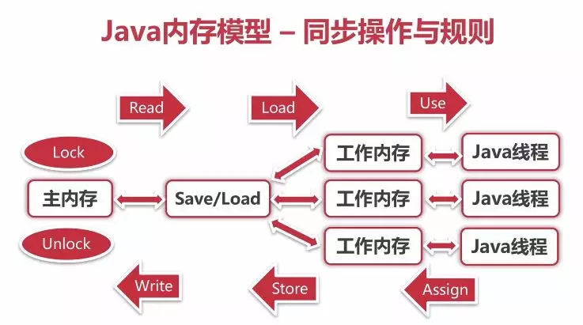

#### volatile修饰的变量的特殊规则

​	在 CPU 执行指令的时候会存在乱序执行优化，这里也是一样，也会为了提高执行效率而对我们写的代码进行优化，但是呢，这里换一个叫法，改名指令重排。之前看到CPU 是通过内存屏障来处理指令优化的，JMM直接搬过来，也使用一些特殊的指令来达到某些指令的顺序执行。这时候JMM 提供了一个关键字`volatile`。

​	关于`volatile`关键字，JMM 专门定义了一套特殊的访问规则，其规则为：假定T表示一个线程，V和W分别表示两个volatile修饰的变量，那么在进行read、load、use、assign、store和write操作的时候需要满足如下规则：

- **只有当线程T对变量V执行的前一个动作是load，线程T对变量V才能执行use动作；同时只有当线程T对变量V执行的后一个动作是use的时候线程T对变量V才能执行load操作。**所以，线程T对变量V的use动作和线程T对变量V的read、load动作相关联，必须是连续一起出现。也就是在线程T的工作内存中，每次使用变量V之前必须从主内存去重新获取最新的值，用于保证线程T能看得见其他线程对变量V的最新的修改后的值。
- **只有当线程T对变量V执行的前一个动作是assign的时候，线程T对变量V才能执行store动作；同时只有当线程T对变量V执行的后一个动作是store的时候，线程T对变量V才能执行assign动作。**所以，线程T对变量V的assign操作和线程T对变量V的store、write动作相关联，必须一起连续出现。也即是在线程T的工作内存中，每次修改变量V之后必须立刻同步回主内存，用于保证线程T对变量V的修改能立刻被其他线程看到。
- **假定动作A是线程T对变量V实施的use或assign动作，动作F是和动作A相关联的load或store动作，动作P是和动作F相对应的对变量V的read或write动作；类似的，假定动作B是线程T对变量W实施的use或assign动作，动作G是和动作B相关联的load或store动作，动作Q是和动作G相对应的对变量W的read或write动作。如果动作A先于B，那么P先于Q。**也就是说在同一个线程内部，被volatile修饰的变量不会被指令重排序，保证代码的执行顺序和程序的顺序相同。

​	总结上面三条规则，前面两条可以概括为：**volatile类型的变量保证对所有线程的可见性**。第三条为：**volatile类型的变量禁止指令重排序优化**。解释一下第一个目的，我们知道在主内存和工作内存中变量交互的时候，假如线程将变量 a + 1，还没有写入主内存的时候，其它线程是不知道 a 的值被修改了。那现在就是希望我在工作内存改了变量之后，其它的线程能看到变量被改了。

​	***valatile类型的变量保证对所有线程的可见性***
 	可见性是指当一个线程修改了这个变量的值，新值（修改后的值）对于其他线程来说是立即可以得知的。正如上面的前两条规则规定，volatile类型的变量每次值被修改了就立即同步回主内存，每次使用时就需要从主内存重新读取值。返回到前面对普通变量的规则中，并没有要求这一点，所以普通变量的值是不会立即对所有线程可见的。
 	误解：volatile变量对所有线程是立即可见的，所以对volatile变量的所有修改(写操作)都立刻能反应到其他线程中。或者换句话说：volatile变量在各个线程中是一致的，所以基于volatile变量的运算在并发下是线程安全的。
​	这个观点的论据是正确的，但是根据论据得出的结论是错误的，并不能得出这样的结论。volatile的规则，保证了read、load、use的顺序和连续行，同理assign、store、write也是顺序和连续的。也就是这几个动作是原子性的，但是对变量的修改，或者对变量的运算，却不能保证是原子性的。如果对变量的修改是分为多个步骤的，那么多个线程同时从主内存拿到的值是最新的，但是经过多步运算后回写到主内存的值是有可能存在覆盖情况发生的。如下代码的例子：

```java
public class VolatileTest {
  public static volatile int race = 0;
  public static void increase() {
    race++
  }

  private static final int THREADS_COUNT = 20;

  public void static main(String[] args) {
      Thread[] threads = new Thread[THREADS_COUNT];
      for (int i= 0; i < THREADS_COUNT; i++) {
          threads[i] = new Thread(new Runnable(){
              @Override
              public void run() {
                  for (int j = 0; j < 10000; j++) {
                      increase();
                  }
              }
          });
          threads[i].start();
      }
      Thread.yield();
      System.out.println(race);
  }
}
```

​	代码就是对volatile类型的变量启动了20个线程，每个线程对变量执行1w次加1操作，如果volatile变量并发操作没有问题的话，那么结果应该是输出20w，但是结果运行的时候每次都是小于20w，这就是因为`race++`操作不是原子性的，是分多个步骤完成的。假设两个线程a、b同时取到了主内存的值，是0，这是没有问题的，在进行`++`操作的时候假设线程a执行到一半，线程b执行完了，这时线程b立即同步给了主内存，主内存的值为1，而线程a此时也执行完了，同步给了主内存，此时的值仍然是1，线程b的结果被覆盖掉了。

***volatile变量禁止指令重排序优化***
	普通的变量仅仅会保证在该方法执行的过程中，所有依赖赋值结果的地方都能获取到正确的结果，但不能保证变量赋值的操作顺序和程序代码的顺序一致。因为在一个线程的方法执行过程中无法感知到这一点，这也就是java内存模型中描述的所谓的“线程内部表现为串行的语义”。
	也就是在单线程内部，我们看到的或者感知到的结果和代码顺序是一致的，即使代码的执行顺序和代码顺序不一致，但是在需要赋值的时候结果也是正确的，所以看起来就是串行的。但实际结果有可能代码的执行顺序和代码顺序是不一致的排。这在多线程中就会出现问题。

​	volatile的指令重排比较晦涩难懂，也很难重现，不建议使用。然后volatile的可见性仅针对于使用boolean类型的共享变量，其他情况还是使用`synchronized`和`lock`来实现。毕竟看清来清晰，而且也不差这一点性能。

#### long和double变量的特殊规则

​	Java内存模型要求对主内存和工作内存交换的八个动作是原子的，正如章节开头所讲，对long和double有一些特殊规则。八个动作中lock、unlock、read、load、use、assign、store、write对待32位的基本数据类型都是原子操作，对待long和double这两个64位的数据，java虚拟机规范对java内存模型的规定中特别定义了一条相对宽松的规则：允许虚拟机将没有被volatile修饰的64位数据的读写操作划分为两次32位的操作来进行，也就是允许虚拟机不保证对64位数据的read、load、store和write这4个动作的操作是原子的。这也就是我们常说的long和double的非原子性协定(Nonautomic Treatment of double and long Variables)。

#### 并发内存模型的实质

​	Java内存模型围绕着并发过程中如何处理原子性、可见性和顺序性这三个特征来设计的。

##### 原子性(Automicity)

​	由Java内存模型来直接保证原子性的变量操作包括read、load、use、assign、store、write这6个动作，虽然存在long和double的特例，但基本可以忽律不计，目前虚拟机基本都对其实现了原子性。如果需要更大范围的控制，lock和unlock也可以满足需求。lock和unlock虽然没有被虚拟机直接开给用户使用，但是提供了字节码层次的指令monitorenter和monitorexit对应这两个操作，对应到java代码就是synchronized关键字，因此在synchronized块之间的代码都具有原子性。

##### 可见性

​	可见性是指一个线程修改了一个变量的值后，其他线程立即可以感知到这个值的修改。正如前面所说，volatile类型的变量在修改后会立即同步给主内存，在使用的时候会从主内存重新读取，是依赖主内存为中介来保证多线程下变量对其他线程的可见性的。
​	除了volatile，synchronized和final也可以实现可见性。synchronized关键字是通过unlock之前必须把变量同步回主内存来实现的，final则是在初始化后就不会更改，所以只要在初始化过程中没有把this指针传递出去也能保证对其他线程的可见性。

##### 有序性

​	有序性从不同的角度来看是不同的。单纯单线程来看都是有序的，但到了多线程就会跟我们预想的不一样。可以这么说：如果在本线程内部观察，所有操作都是有序的；如果在一个线程中观察另一个线程，所有的操作都是无序的。前半句说的就是“线程内表现为串行的语义”，后半句值得是“指令重排序”现象和主内存与工作内存之间同步存在延迟的现象。
 保证有序性的关键字有volatile和synchronized，volatile禁止了指令重排序，而synchronized则由“一个变量在同一时刻只能被一个线程对其进行lock操作”来保证。

​	总体来看，synchronized对三种特性都有支持，虽然简单，但是如果无控制的滥用对性能就会产生较大影响。

#### 先行发生原则

​	如果Java内存模型中所有的有序性都要依靠volatile和synchronized来实现，那是不是非常繁琐。Java语言中有一个“先行发生原则”，是判断数据是否存在竞争、线程是否安全的主要依据。

​	先行发生原则是Java内存模型中定义的两个操作之间的偏序关系。比如说操作A先行发生于操作B，那么在B操作发生之前，A操作产生的“影响”都会被操作B感知到。这里的影响是指修改了内存中的共享变量、发送了消息、调用了方法等。个人觉得更直白一些就是有可能对操作B的结果有影响的都会被B感知到，对B操作的结果没有影响的是否感知到没有太大关系。

#### Java内存模型自带先行原则

- 程序次序原则
   在一个线程内部，按照代码的顺序，书写在前面的先行发生与后边的。或者更准确的说是在控制流顺序前面的先行发生与控制流后面的，而不是代码顺序，因为会有分支、跳转、循环等。

- 管程锁定规则
   一个unlock操作先行发生于后面对同一个锁的lock操作。这里必须注意的是对同一个锁，后面是指时间上的后面

- volatile变量规则
   对一个volatile变量的写操作先行发生与后面对这个变量的读操作，这里的后面是指时间上的先后顺序

- 线程启动规则
   Thread对象的start()方法先行发生与该线程的每个动作。当然如果你错误的使用了线程，创建线程后没有执行start方法，而是执行run方法，那此句话是不成立的，但是如果这样其实也不是线程了

- 线程终止规则
   线程中的所有操作都先行发生与对此线程的终止检测，可以通过Thread.join()和Thread.isAlive()的返回值等手段检测线程是否已经终止执行

- 线程中断规则
   对线程interrupt()方法的调用先行发生于被中断线程的代码检测到中断事件的发生，可以通过Thread.interrupted()方法检测到是否有中断发生。

- 对象终结规则
   一个对象的初始化完成先行发生于他的finalize方法的执行，也就是初始化方法先行发生于finalize方法

- 传递性
   如果操作A先行发生于操作B，操作B先行发生于操作C，那么操作A先行发生于操作C。

  看一个例子:

```java
private int value = 0;
public void setValue(int value) {
  this.value = value;
}
public int getValue() {
  return this.value;
}
```

​	如果有两个线程A和B，A先调用setValue方法，然后B调用getValue方法，那么B线程执行方法返回的结果是什么？
​	我们去对照先行发生原则一个一个对比。首先是**程序次序规则**，这里是多线程，不在一个线程中，不适用；然后是**管程锁定规则**，这里没有synchronized，自然不会发生lock和unlock，不适用；后面对于**线程启动规则**、**线程终止规则**、**线程中断规则**也不适用，这里与**对象终结规则**、**传递性规则**也没有关系。所以说B返回的结果是不确定的，也就是说在多线程环境下该操作不是线程安全的。
​	如何修改呢，一个是对get/set方法加入synchronized 关键字，可以使用**管程锁定规则**；要么对value加volatile修饰，可以使用**volatile变量规则**。
​	通过上面的例子可知，一个操作时间上先发生并不代表这个操作先行发生，那么一个操作先行发生是不是代表这个操作在时间上先发生？也不是，如下面的例子：

```java
int i = 2;
int j = 1;
```

​	在同一个线程内，对i的赋值先行发生于对j赋值的操作，但是代码重排序优化，也有可能是j的赋值先发生，我们无法感知到这一变化。

所以，综上所述，时间先后顺序与先行发生原则之间基本没有太大关系。我们衡量并发安全的问题的时候不要受到时间先后顺序的干扰，一切以先行发生原则为准。

### 同步处理

#### synchronized定义及原理

​	synchronized 的作用主要有三个：

- 确保线程互斥的访问同步代码
- 保证共享变量的修改能够及时可见
- 有效解决重排序问题

​	在java语言中存在两种内建的synchronized语法：1、synchronized语句；2、synchronized方法。

​	对于synchronized语句当Java源代码被javac编译成bytecode的时候，会在同步块的入口位置和退出位置分别插入monitorenter和monitorexit字节码指令。而synchronized方法则会被翻译成普通的方法调用和返回指令如:invokevirtual、areturn指令，在VM字节码层面并没有任何特别的指令来实现被synchronized修饰的方法，而是在Class文件的方法表中将该方法的access_flags字段中的synchronized标志位置1，表示该方法是同步方法并使用调用该方法的对象或该方法所属的Class在JVM的内部对象表示Class做为锁对象。

##### monitor

1. Monitor对象是jvm实现的，c++中的对象。

2. 每个对象内部都有一个唯一的monitor,monitor的获取是互斥的。

3. synchronized通过monitor来实现互斥。

4. monitor的本质是依赖于底层操作系统的Mutex Lock实现，操作系统实现线程之间的切换需要从用户态到内核态的切换，切换成本非常高。

##### synchronized语句

```java
package com.paddx.test.concurrent; 
public class SynchronizedDemo {
    private final Object obj = new Object();
    public void method() {
        synchronized (obj){
            System.out.println("hello world");
        }
    } 
}
```
​	反编译结果：


​	每个对象有一个监视器锁(Monitor)，当 Monitor 被占用时就会处于锁定状态。

​	线程执行`Monitorenter`指令时尝试获取Monitor的所有权，过程如下：

- 如果Monitor的进入数为0，则该线程进入Monitor，然后将进入数设置为1，该线程即为Monitor的所有者。
- 如果线程已经占有该Monitor，只是重新进入，则进入Monitor的进入数加1。
- 如果其他线程已经占用了Monitor，则该线程进入阻塞状态，直到Monitor的进入数为 0，再重新尝试获取Monitor的所有权。

​	执行`Monitorexit`的线程必须是Objectref所对应的Monitor的所有者。指令执行时，Monitor的进入数减 1，如果减 1 后进入数为 0，那线程退出Monitor，不再是这个Monitor的所有者。其他被这个Monitor阻塞的线程可以尝试去获取这个Monitor的所有权。

​	通过这两段描述，我们应该能很清楚的看出`Synchronized`的实现原理。`Synchronized`的语义底层是通过一个Monitor 的对象来完成，其实 Wait/Notify 等方法也依赖于 Monitor 对象。

##### synchronized方法

```java
package com.paddx.test.concurrent; 
public class SynchronizedMethod { 
    public synchronized void method() { 
      System.out.println("Hello World!"); 
    } 
} 
```

​	反编译结果：

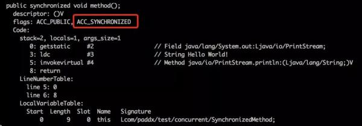

​	从反编译的结果来看，方法的同步并没有通过指令`Monitorenter`和`Monitorexit`来完成(理论上其实也可以通过这两条指令来实现)。不过相对于普通方法，其常量池中多了`ACC_SYNCHRONIZED`标示符。

​	JVM 就是根据该标示符来实现方法的同步的：当方法调用时，调用指令将会检查方法的`ACC_SYNCHRONIZED`访问标志是否被设置。如果设置了，执行线程将先获取Monitor，获取成功之后才能执行方法体，方法执行完后再释放 Monitor。在方法执行期间，其他任何线程都无法再获得同一个Monitor对象。

​	其实本质上没有区别，只是方法的同步是一种隐式的方式来实现，无需通过字节码来完成。

#### JDK synchronized优化

​	JDK 1.6，Java对synchronized同步锁做了充分的优化，甚至在某些场景下，它的性能已经超越了Lock同步锁。其优化了两方面的内容。

1. 为了提升性能，在JDK 1.6引入偏向锁、轻量级锁、重量级锁，用来减少锁竞争带来的上下文切换
2. 借助JDK 1.6新增的Java对象头，实现了锁升级功能

##### Java对象头

1. 在JDK 1.6的JVM中，对象实例在堆内存中被分为三部分：对象头、实例数据、对齐填充

2. 对象头的组成部分：Mark Word、指向类的指针、数组长度（可选，数组类型时才有）

3. Mark Word记录了对象和锁有关的信息，在64位的JVM中，Mark Word为64 bit

4. 锁升级功能主要依赖于Mark Word中锁标志位和是否偏向锁标志位

5. synchronized同步锁的升级优化路径：偏向锁 -> 轻量级锁 -> 重量级锁

 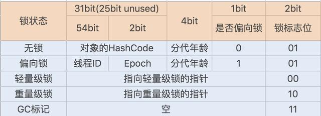

##### 偏向锁

​	偏向锁主要用来优化同一线程多次申请同一个锁的竞争，在某些情况下，大部分时间都是同一个线程竞争锁资源。偏向锁的作用：

1. 当一个线程再次访问同一个同步代码时，该线程只需对该对象头的Mark Word中去判断是否有偏向锁指向它

2. 无需再进入Monitor去竞争对象（避免用户态和内核态的切换）

​	当对象被当做同步锁，并有一个线程抢到锁时，锁标志位还是01，是否偏向锁标志位设置为1，并且记录抢到锁的线程ID，进入偏向锁状态。偏向锁不会主动释放锁,当线程1再次获取锁时，会比较当前线程的ID与锁对象头部的线程ID是否一致，如果一致，无需CAS来抢占锁。如果不一致，需要查看锁对象头部记录的线程是否存活。如果没有存活，那么锁对象被重置为无锁状态（也是一种撤销），然后重新偏向线程2。如果存活，查找线程1的栈帧信息。如果线程1还是需要继续持有该锁对象，那么暂停线程1（STW），撤销偏向锁，升级为轻量级锁。如果线程1不再使用该锁对象，那么将该锁对象设为无锁状态（也是一种撤销），然后重新偏向线程2。

​	一旦出现其他线程竞争锁资源时，偏向锁就会被撤销。偏向锁的撤销可能需要等待全局安全点，暂停持有该锁的线程，同时检查该线程是否还在执行该方法。如果还没有执行完，说明此刻有多个线程竞争，升级为轻量级锁；如果已经执行完毕，唤醒其他线程继续CAS抢占。在高并发场景下，当大量线程同时竞争同一个锁资源时，偏向锁会被撤销，发生STW，加大了性能开销。

> 默认配置 -XX:+UseBiasedLocking -XX:BiasedLockingStartupDelay=4000
> 默认开启偏向锁，并且延迟生效，因为JVM刚启动时竞争非常激烈
> 关闭偏向锁   -XX:-UseBiasedLocking
> 设置为重量级锁  -XX:+UseHeavyMonitors

红线流程部分：偏向锁的获取和撤销。

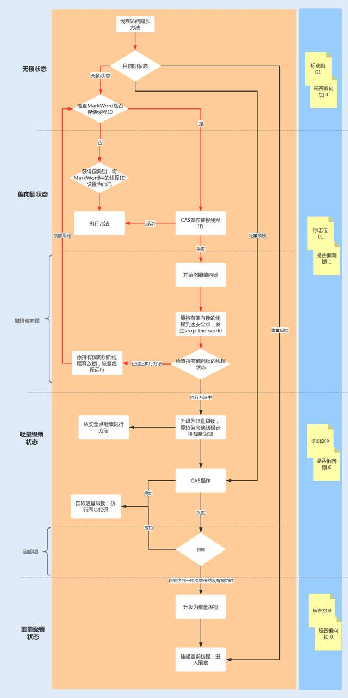

##### 轻量级锁

​	当有另外一个线程竞争锁时，由于该锁处于偏向锁状态，发现对象头Mark Word中的线程ID不是自己的线程ID，该线程就会执行CAS操作获取锁

- 如果获取成功，直接替换Mark Word中的线程ID为自己的线程ID，该锁会保持偏向锁状态
- 如果获取失败，说明当前锁有一定的竞争，将偏向锁升级为轻量级锁

​	线程获取轻量级锁时会有两步

 1. 先把锁对象的Mark Word复制一份到线程的栈帧中（DisplacedMarkWord），主要为了保留现场!!
 2. 然后使用CAS，把对象头中的内容替换为线程栈帧中DisplacedMarkWord的地址

场景

- 在线程1复制对象头Mark Word的同时（CAS之前），线程2也准备获取锁，也复制了对象头Mark Word
- 在线程2进行CAS时，发现线程1已经把对象头换了，线程2的CAS失败，线程2会尝试使用自旋锁来等待线程1释放锁

1. 轻量级锁的适用场景：线程交替执行同步块，绝大部分的锁在整个同步周期内都不存在长时间的竞争

​	红线流程部分：升级轻量级锁

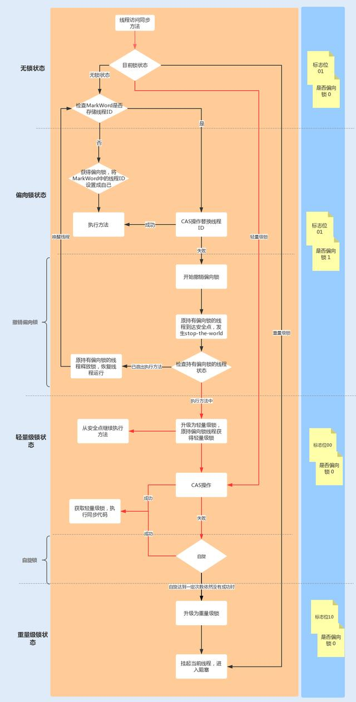

##### 自旋锁 / 重量级锁

​	轻量级锁CAS抢占失败，线程将会被挂起进入阻塞状态，如果正在持有锁的线程在很短的时间内释放锁资源，那么进入阻塞状态的线程被唤醒后又要重新抢占锁资源。

1. JVM提供了自旋锁，可以通过自旋的方式不断尝试获取锁，从而避免线程被挂起阻塞
2. 从JDK 1.7开始，自旋锁默认启用，自旋次数不建议设置过大（意味着长时间占用CPU）

> 设置方法：
> -XX:+UseSpinning -XX:PreBlockSpin=10

​	若自旋锁重试之后如果依然抢锁失败，同步锁会升级至重量级锁，锁标志位为10。在这个状态下，未抢到锁的线程都会进入Monitor，之后会被阻塞在WaitSet中。在锁竞争不激烈且锁占用时间非常短的场景下，自旋锁可以提高系统性能，一旦锁竞争激烈或者锁占用的时间过长，自旋锁将会导致大量的线程一直处于CAS重试状态，占用CPU资源。

> 在高并发的场景下，可以通过关闭自旋锁来优化系统性能
> -XX:-UseSpinning  关闭自旋锁优化
> -XX:PreBlockSpin   默认的自旋次数，在JDK 1.7后，由JVM控制

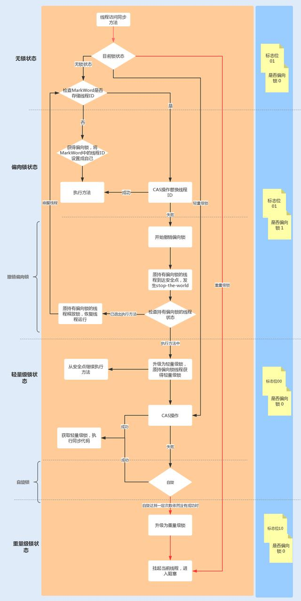

##### 总结

1.JVM在JDK 1.6中引入了分级锁机制来优化`synchronized`

2.当一个线程获取锁时，首先对象锁成为一个偏向锁

- 这是为了避免在同一线程重复获取同一把锁时，用户态和内核态频繁切换

3.如果有多个线程竞争锁资源，锁将会升级为轻量级锁

- 这适用于在短时间内持有锁，且分锁交替切换的场景
- 轻量级锁还结合了自旋锁来避免线程用户态与内核态的频繁切换

4.如果锁竞争太激烈（自旋锁失败），同步锁会升级为重量级锁

5.优化synchronized同步锁的关键：减少锁竞争

- 应该尽量使synchronized同步锁处于轻量级锁或偏向锁，这样才能提高synchronized同步锁的性能
- 常用手段
- 减少锁粒度：降低锁竞争
- 减少锁的持有时间，提高synchronized同步锁在自旋时获取锁资源的成功率，避免升级为重量级锁

6.在锁竞争激烈时，可以考虑禁用偏向锁和禁用自旋锁


#### AbstractQueuedSynchronizer

​	AbstractQueuedSynchronizer(AQS)是JDK中实现并发编程的核心，平时我们工作中经常用到的ReentrantLock，CountDownLatch等都是基于它来实现的。

​	 AQS类中维护了一个双向链表(FIFO队列)， 如下图所示：

​    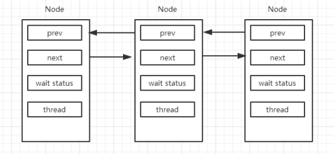

​    队列中的每个元素都用一个Node表示，我们可以看到，Node类中有几个静态常量表示的状态：

```java
static final class Node {
    // 共享模式下等待的标记
    static final Node SHARED = new Node();
    // 独占模式下等待的标记
    static final Node EXCLUSIVE = null;

    // 线程的等待状态 表示线程已经被取消
    static final int CANCELLED =  1;
    // 线程的等待状态 表示后继线程需要被唤醒
    static final int SIGNAL    = -1;
    // 线程的等待状态 表示线程在Condtion上
    static final int CONDITION = -2;
    
    // 表示下一个acquireShared需要无条件的传播
    static final int PROPAGATE = -3;

    /**
     *   SIGNAL:     当前节点的后继节点处于等待状态时,如果当前节点的同步状态被释放或者取消,
     *               必须唤起它的后继节点
     *         
     *   CANCELLED:  一个节点由于超时或者中断需要在CLH队列中取消等待状态,被取消的节点不会再次等待
     *               
     *   CONDITION:  当前节点在等待队列中,只有当节点的状态设为0的时候该节点才会被转移到同步队列
     *               
     *   PROPAGATE:  下一次的共享模式同步状态的获取将会无条件的传播

     *   waitStatus的初始值时0,使用CAS来修改节点的状态
     */
    volatile int waitStatus;

    /**
     * 当前节点的前驱节点,当前线程依赖它来检查waitStatus,在入队的时候才被分配,
     * 并且只在出队的时候才被取消(为了GC),头节点永远不会被取消,一个节点成为头节点
     * 仅仅是成功获取到锁的结果,一个被取消的线程永远也不会获取到锁,线程只取消自身,
     * 而不涉及其他节点
     */
    volatile Node prev;

    /**
     * 当前节点的后继节点,当前线程释放的才被唤起,在入队时分配,在绕过被取消的前驱节点
     * 时调整,在出队列的时候取消(为了GC)
     * 如果一个节点的next为空,我们可以从尾部扫描它的prev,双重检查
     * 被取消节点的next设置为指向节点本身而不是null,为了isOnSyncQueue更容易操作
     */
    volatile Node next;

    /**
     * 当前节点的线程,初始化后使用,在使用后失效 
     */
    volatile Thread thread;

    /**
     * 链接到下一个节点的等待条件,或特殊的值SHARED,因为条件队列只有在独占模式时才能被访问,
     * 所以我们只需要一个简单的连接队列在等待的时候保存节点,然后把它们转移到队列中重新获取
     * 因为条件只能是独占性的,我们通过使用特殊的值来表示共享模式
     */
    Node nextWaiter;

    /**
     * 如果节点处于共享模式下等待直接返回true
     */
    final boolean isShared() {
        return nextWaiter == SHARED;
    }

    /**
     * 返回当前节点的前驱节点,如果为空,直接抛出空指针异常
     */
    final Node predecessor() throws NullPointerException {
        Node p = prev;
        if (p == null)
            throw new NullPointerException();
        else
            return p;
    }

    Node() {    // 用来建立初始化的head 或 SHARED的标记
    }

    Node(Thread thread, Node mode) {     // 指定线程和模式的构造方法
        this.nextWaiter = mode;
        this.thread = thread;
    }

    Node(Thread thread, int waitStatus) { // 指定线程和节点状态的构造方法
        this.waitStatus = waitStatus;
        this.thread = thread;
    }    
}
```

​	Node是构成同步队列的基础，看一下Node的结构：

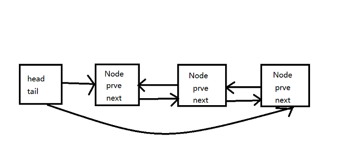

同步队列中首节点是获取到锁的节点，它在释放的时候会唤醒后继节点，后继节点获取到锁的时候,会把自己设为首节点。

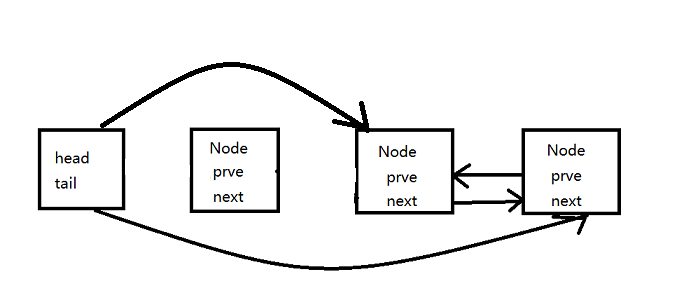

​	现在我们可以清楚的知道这样几点：

1.  **节点的数据结构，即AQS的静态内部类Node,节点的等待状态等信息**；
2.  **同步队列是一个双向队列，AQS通过持有头尾指针管理同步队列**；

​	那么，节点如何进行入队和出队是怎样做的了？实际上这对应着锁的获取和释放两个操作：获取锁失败进行入队操作，获取锁成功进行出队操作。

##### 独占锁获取（acquire）

```java
public final void acquire(int arg) {
    //先看同步状态是否获取成功，如果成功则方法结束返回
    //若失败则先调用addWaiter()方法再调用acquireQueued()方法
    if (!tryAcquire(arg) &&
        acquireQueued(addWaiter(Node.EXCLUSIVE), arg))
        selfInterrupt();
}
// 获取失败的情况，增加一个等待者到队列中
private Node addWaiter(Node mode) {
    Node node = new Node(Thread.currentThread(), mode);
    // Try the fast path of enq; backup to full enq on failure
    Node pred = tail;
    // 尾节点不为空的情况
    if (pred != null) {
        // 当前节点前一个为尾节点
        node.prev = pred;
        // 插入到末尾，返回
        if (compareAndSetTail(pred, node)) {
            pred.next = node;
            return node;
        }
    }
    // 尾节点为空，说明当前线程是第一个加入同步队列进行等待的线程
    enq(node);
    return node;
}
// 当尾节点为空，或者插入到末尾失败的情况
private Node enq(final Node node) {
    for (;;) {
        Node t = tail;
        if (t == null) { // Must initialize
            // 节点为空，初始化队列，失败了说明有人初始化，自旋
            if (compareAndSetHead(new Node()))
                tail = head;
        } else {
            node.prev = t;
            if (compareAndSetTail(t, node)) {
                // 插入到末尾，如果失败了，自旋，只有成功才能返回
                t.next = node;
                return t;
            }
        }
    }
}
// 排队获取锁
final boolean acquireQueued(final Node node, int arg) {
    boolean failed = true;
    try {
        boolean interrupted = false;
        for (;;) {
            // 获取前驱节点
            final Node p = node.predecessor();
            // 如果前驱节点是头节点且获取锁成功	
            if (p == head && tryAcquire(arg)) {
                // 将该节点设置为头节点,返回非中断式，也未失败
                setHead(node);
                p.next = null; // help GC
                failed = false;
                return interrupted;
            }
            if (shouldParkAfterFailedAcquire(p, node) &&
                parkAndCheckInterrupt())
                interrupted = true;
        }
    } finally {
        //中断的话，取消获取节点
        if (failed)
            cancelAcquire(node);
    }
}
//获取失败的时候是否需要等待	
private static boolean shouldParkAfterFailedAcquire(Node pred, Node node) {
	// 获取pred前置节点的等待状态
    int ws = pred.waitStatus;
    if (ws == Node.SIGNAL)
        /*
         * This node has already set status asking a release
         * to signal it, so it can safely park.
         * 前置节点状态是signal，那当前节点可以安全阻塞，因为前置节点承诺执行完之后会通知唤醒当前节点
         */
        return true;
    if (ws > 0) {
        /*
         * Predecessor was cancelled. Skip over predecessors and
         * indicate retry.
         * 前置节点如果已经被取消了，则一直往前遍历直到前置节点不是取消状态，与此同时会修改链表关系
         */
        do {
            node.prev = pred = pred.prev;
        } while (pred.waitStatus > 0);
        pred.next = node;
    } else {
        /*
         * waitStatus must be 0 or PROPAGATE.  Indicate that we
         * need a signal, but don't park yet.  Caller will need to
         * retry to make sure it cannot acquire before parking.
         * 前置节点是0或者propagate状态，这里通过CAS把前置节点状态改成signal,这里不返回true让当前节点阻塞，而是返回false，目的是让调用者再check一下当前线程是否能成功获取锁，失败的话再阻塞
         */
        compareAndSetWaitStatus(pred, ws, Node.SIGNAL);
    }
    return false;
}
// 是否中断了
private final boolean parkAndCheckInterrupt() {
    // 阻塞当前线程，监事是当前sync对象
    LockSupport.park(this);
    return Thread.interrupted();
}
// 取消获取锁
private void cancelAcquire(Node node) {
    // Ignore if node doesn't exist
    if (node == null)
        return;
    // 把当前节点的线程设为null
    node.thread = null;

    // Skip cancelled predecessors
    Node pred = node.prev;
    // 如果prde的ws > 0,直接跳过pred继续往前遍历,直到pred的ws <= 0
    while (pred.waitStatus > 0)
        node.prev = pred = pred.prev;

    // predNext is the apparent node to unsplice. CASes below will
    // fail if not, in which case, we lost race vs another cancel
    // or signal, so no further action is necessary.
    Node predNext = pred.next;

    // Can use unconditional write instead of CAS here.
    // After this atomic step, other Nodes can skip past us.
    // Before, we are free of interference from other threads.
    // 设置为取消状态
    node.waitStatus = Node.CANCELLED;

    // If we are the tail, remove ourselves.
    // 如果node是尾节点,利用CAS把pred设为尾节点,predNext为null
    if (node == tail && compareAndSetTail(node, pred)) {
        compareAndSetNext(pred, predNext, null);
    } else {
        // If successor needs signal, try to set pred's next-link
        // so it will get one. Otherwise wake it up to propagate.
        // pred不是头结点 && pred的线程不为空 && pred.ws = singal
        // 利用CAS把node的next设为pred的next节点
        int ws;
        if (pred != head &&
            ((ws = pred.waitStatus) == Node.SIGNAL ||
             (ws <= 0 && compareAndSetWaitStatus(pred, ws, Node.SIGNAL))) &&
            pred.thread != null) {
            Node next = node.next;
            if (next != null && next.waitStatus <= 0)
                compareAndSetNext(pred, predNext, next);
        } else {
            // node是头结点,唤起它的后继节点
            unparkSuccessor(node);
        }

        node.next = node; // help GC
    }
}
```

​	经过上面的分析，独占式锁的获取过程也就是acquire()方法的执行流程如下图所示：

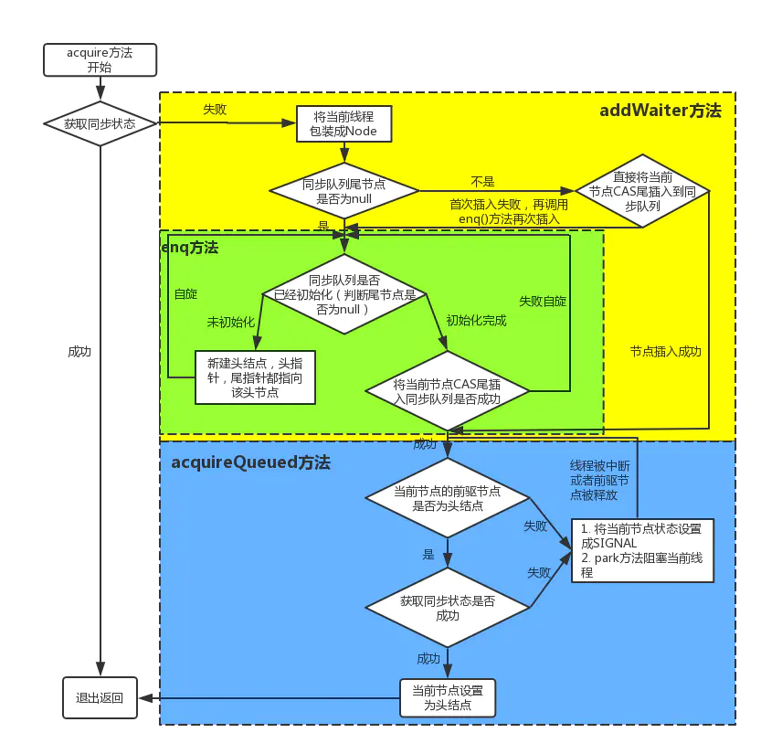

##### 独占锁释放（release）

```java
public final boolean release(int arg) {
    // 通过模板方法调用子类的tryRelease()释放
    if (tryRelease(arg)) {
        Node h = head;
        if (h != null && h.waitStatus != 0)
            unparkSuccessor(h);
        return true;
    }
    return false;
}
// 醒等待的队列中的下一个节点的线程
private void unparkSuccessor(Node node) {
    /*
     * If status is negative (i.e., possibly needing signal) try
     * to clear in anticipation of signalling.  It is OK if this
     * fails or if status is changed by waiting thread.
     */
	// 获取node的ws,如果ws<0,使用CAS把node的ws设为0,表示释放同步状态
    int ws = node.waitStatus;
    if (ws < 0)
        compareAndSetWaitStatus(node, ws, 0);

    /*
     * Thread to unpark is held in successor, which is normally
     * just the next node.  But if cancelled or apparently null,
     * traverse backwards from tail to find the actual
     * non-cancelled successor.
     */
	/**
	获取node的后继节点s,根据条件s = null 或者 s.ws > 0,从同步队列的尾部开始遍历,
     * 直到找到距node最近的满足ws <= 0的节点t,把t赋给s,唤醒s节点的线程
     * 如果s不为null && s的ws <= 0,直接唤醒s的线程
    */
    Node s = node.next;
    if (s == null || s.waitStatus > 0) {
        s = null;
        for (Node t = tail; t != null && t != node; t = t.prev)
            if (t.waitStatus <= 0)
                s = t;
    }
    if (s != null)
        LockSupport.unpark(s.thread);
}
```

##### 独占锁总结

1.  线程获取锁失败，线程被封装成Node进行入队操作，核心方法在于addWaiter()和enq()，同时enq()完成对同步队列的头结点初始化工作以及CAS操作失败的重试

2.  线程获取锁是一个自旋的过程，当且仅当 当前节点的前驱节点是头结点并且成功获得同步状态时，节点出队即该节点引用的线程获得锁，否则，当不满足条件时就会调用LookSupport.park()方法使得线程阻塞

3. 释放锁的时候会唤醒后继节点

​	总体来说：在获取同步状态时，AQS维护一个同步队列，获取同步状态失败的线程会加入到队列中进行自旋；移除队列（或停止自旋）的条件是前驱节点是头结点并且成功获得了同步状态。在释放同步状态时，同步器会调用unparkSuccessor()方法唤醒后继节点。

##### 超时等待获取锁（tryAcquireNanos）

```java
public final boolean tryAcquireNanos(int arg, long nanosTimeout)
    throws InterruptedException {
    if (Thread.interrupted())
        throw new InterruptedException();
    return tryAcquire(arg) ||
        doAcquireNanos(arg, nanosTimeout);
}

/**
 * The number of nanoseconds for which it is faster to spin
 * rather than to use timed park. A rough estimate suffices
 * to improve responsiveness with very short timeouts.
 */
static final long spinForTimeoutThreshold = 1000L;

private boolean doAcquireNanos(int arg, long nanosTimeout)
    throws InterruptedException {
    if (nanosTimeout <= 0L)
        return false;
    // 算截止时间点
    final long deadline = System.nanoTime() + nanosTimeout;
    final Node node = addWaiter(Node.EXCLUSIVE);
    boolean failed = true;
    try {
        for (;;) {
            final Node p = node.predecessor();
            if (p == head && tryAcquire(arg)) {
                setHead(node);
                p.next = null; // help GC
                failed = false;
                return true;
            }
            // 重算还有多久截止
            nanosTimeout = deadline - System.nanoTime();
            if (nanosTimeout <= 0L)
                return false;
            if (shouldParkAfterFailedAcquire(p, node) &&
                nanosTimeout > spinForTimeoutThreshold)
                // 超过了1000ns,即1微秒，则等待后续的时间
                LockSupport.parkNanos(this, nanosTimeout);
            if (Thread.interrupted())
                // 线程被中断抛出被中断异常
                throw new InterruptedException();
        }
    } finally {
        if (failed)
            cancelAcquire(node);
    }
}
```

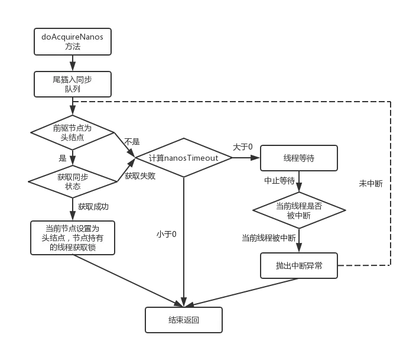

##### 可中断式获取锁（acquireInterruptibly）

```java
public final void acquireInterruptibly(int arg)
    throws InterruptedException {
    // 线程中断直接返回
    if (Thread.interrupted())
        throw new InterruptedException();
    // 首先获取一下锁，没获取到，调用再次获取方法
    if (!tryAcquire(arg))
        doAcquireInterruptibly(arg);
}

private void doAcquireInterruptibly(int arg)
    throws InterruptedException {
    // 加入独占式的状态的队列
    final Node node = addWaiter(Node.EXCLUSIVE);
    boolean failed = true;
    try {
        for (;;) {
            final Node p = node.predecessor();
            if (p == head && tryAcquire(arg)) {
                setHead(node);
                p.next = null; // help GC
                failed = false;
                return;
            }
            if (shouldParkAfterFailedAcquire(p, node) &&
                parkAndCheckInterrupt())
                // 和独占锁唯一的区别，中断的情况，直接抛出异常，说明其可中断的
                throw new InterruptedException();
        }
    } finally {
        if (failed)
            cancelAcquire(node);
    }
}
```

##### 共享锁的获取（acquireShared）

```java
public final void acquireShared(int arg) {
    if (tryAcquireShared(arg) < 0)
        doAcquireShared(arg);
}

private void doAcquireShared(int arg) {
    final Node node = addWaiter(Node.SHARED);
    boolean failed = true;
    try {
        boolean interrupted = false;
        for (;;) {
            final Node p = node.predecessor();
            if (p == head) {
                //留给子类实现，只要大于0就算获取成功
                int r = tryAcquireShared(arg);
                if (r >= 0) {
                    setHeadAndPropagate(node, r);
                    p.next = null; // help GC
                    if (interrupted)
                        selfInterrupt();
                    failed = false;
                    return;
                }
            }
            if (shouldParkAfterFailedAcquire(p, node) &&
                parkAndCheckInterrupt())
                interrupted = true;
        }
    } finally {
        if (failed)
            cancelAcquire(node);
    }
}
// 设置头节点，传播唤醒
private void setHeadAndPropagate(Node node, int propagate) {
    Node h = head; // Record old head for check below
    setHead(node);
    /*
     * Try to signal next queued node if:
     *   Propagation was indicated by caller,
     *     or was recorded (as h.waitStatus either before
     *     or after setHead) by a previous operation
     *     (note: this uses sign-check of waitStatus because
     *      PROPAGATE status may transition to SIGNAL.)
     * and
     *   The next node is waiting in shared mode,
     *     or we don't know, because it appears null
     *
     * The conservatism in both of these checks may cause
     * unnecessary wake-ups, but only when there are multiple
     * racing acquires/releases, so most need signals now or soon
     * anyway.
     */
    /*
     * 这里有三种情况执行唤醒操作：1.propagate > 0,代表后继节点需要被唤醒
     *                          2. h节点的ws < 0或者 h=null
     *                          3. 新的头结点为空 或者 新的头结点的ws < 0
     */
    if (propagate > 0 || h == null || h.waitStatus < 0 ||
        (h = head) == null || h.waitStatus < 0) {
        Node s = node.next;
        if (s == null || s.isShared())
            // s=null 或者 s是共享模式,调用doReleaseShared方法唤醒后继线程
            doReleaseShared();
    }
}
```

##### 共享锁的释放（releaseShared）

```java
public final boolean releaseShared(int arg) {
    if (tryReleaseShared(arg)) {
        doReleaseShared();
        return true;
    }
    return false;
}

/*此方法的流程也比较简单，一句话：释放掉资源后，唤醒后继。
跟独占模式下的release()相似，但有一点稍微需要注意：
独占模式下的tryRelease()在完全释放掉资源（state=0）后，
才会返回true去唤醒其他线程，这主要是基于独占下可重入的考量；
而共享模式下的releaseShared()则没有这种要求，
共享模式实质就是控制一定量的线程并发执行，
那么拥有资源的线程在释放掉部分资源时就可以唤醒后继等待结点。
例如，资源总量是13，A（5）和B（7）分别获取到资源并发运行，C（4）来时只剩1个资源
就需要等待。A在运行过程中释放掉2个资源量，然后tryReleaseShared(2)返回true唤醒C，
C一看只有3个仍不够继续等待；随后B又释放2个，tryReleaseShared(2)返回true唤醒C，
C一看有5个够自己用了，然后C就可以跟A和B一起运行。
而ReentrantReadWriteLock读锁的tryReleaseShared()只有在完全释放掉资源（state=0）才返回true，
所以自定义同步器可以根据需要决定tryReleaseShared()的返回值。*/
private void doReleaseShared() {
    /*
     * Ensure that a release propagates, even if there are other
     * in-progress acquires/releases.  This proceeds in the usual
     * way of trying to unparkSuccessor of head if it needs
     * signal. But if it does not, status is set to PROPAGATE to
     * ensure that upon release, propagation continues.
     * Additionally, we must loop in case a new node is added
     * while we are doing this. Also, unlike other uses of
     * unparkSuccessor, we need to know if CAS to reset status
     * fails, if so rechecking.
     */
    for (;;) {
        Node h = head;
        if (h != null && h != tail) {
            int ws = h.waitStatus;
            if (ws == Node.SIGNAL) {
                if (!compareAndSetWaitStatus(h, Node.SIGNAL, 0))
                    continue;            // loop to recheck cases
                // 唤醒头结点的后继节点
                unparkSuccessor(h);
            }
            else if (ws == 0 &&
                     !compareAndSetWaitStatus(h, 0, Node.PROPAGATE))
                continue;                // loop on failed CAS
        }
        if (h == head)                   // loop if head changed
            break;
    }
}
```

#### ReentrantLock

```java
// 内部静态继承了同步器
abstract static class Sync extends AbstractQueuedSynchronizer {
    private static final long serialVersionUID = -5179523762034025860L;

    /**
     * Performs {@link Lock#lock}. The main reason for subclassing
     * is to allow fast path for nonfair version.
     */
    // 由子类的公平锁和非公平锁去实现
    abstract void lock();

    /**
     * Performs non-fair tryLock.  tryAcquire is implemented in
     * subclasses, but both need nonfair try for trylock method.
     */
    // 默认非公平锁的获取
    final boolean nonfairTryAcquire(int acquires) {
        final Thread current = Thread.currentThread();
        int c = getState();
        if (c == 0) {
            // 非锁状态可以CAS获取锁，这里大家都可以去抢锁，但是如果被别的线程抢了，返回false
            if (compareAndSetState(0, acquires)) {
                setExclusiveOwnerThread(current);
                return true;
            }
        }
        else if (current == getExclusiveOwnerThread()) {
            // 自己已经获取了锁，信号量累加，可重入的概念
            int nextc = c + acquires;
            if (nextc < 0) // overflow
                throw new Error("Maximum lock count exceeded");
            setState(nextc);
            return true;
        }
        return false;
    }
	// 释放锁
    protected final boolean tryRelease(int releases) {
        int c = getState() - releases;
        if (Thread.currentThread() != getExclusiveOwnerThread())
            throw new IllegalMonitorStateException();
        boolean free = false;
        if (c == 0) {
            free = true;
            setExclusiveOwnerThread(null);
        }
        setState(c);
        return free;
    }

    protected final boolean isHeldExclusively() {
        // While we must in general read state before owner,
        // we don't need to do so to check if current thread is owner
        return getExclusiveOwnerThread() == Thread.currentThread();
    }

    final ConditionObject newCondition() {
        return new ConditionObject();
    }

    // Methods relayed from outer class

    final Thread getOwner() {
        return getState() == 0 ? null : getExclusiveOwnerThread();
    }

    final int getHoldCount() {
        return isHeldExclusively() ? getState() : 0;
    }

    final boolean isLocked() {
        return getState() != 0;
    }

    /**
     * Reconstitutes the instance from a stream (that is, deserializes it).
     */
    private void readObject(java.io.ObjectInputStream s)
        throws java.io.IOException, ClassNotFoundException {
        s.defaultReadObject();
        setState(0); // reset to unlocked state
    }
}
// 公平锁
static final class FairSync extends Sync {
    private static final long serialVersionUID = -3000897897090466540L;

    final void lock() {
        // 获取锁
        acquire(1);
    }

    /**
     * Fair version of tryAcquire.  Don't grant access unless
     * recursive call or no waiters or is first.
     */
    // 模板方法，看是否能获取到锁
    protected final boolean tryAcquire(int acquires) {
        final Thread current = Thread.currentThread();
        int c = getState();
        if (c == 0) {
            // 公平锁重点，判断是否队列中有节点在处理，如果有，则不会返回true
            if (!hasQueuedPredecessors() &&
                compareAndSetState(0, acquires)) {
                setExclusiveOwnerThread(current);
                return true;
            }
        }
        else if (current == getExclusiveOwnerThread()) {
            int nextc = c + acquires;
            if (nextc < 0)
                throw new Error("Maximum lock count exceeded");
            setState(nextc);
            return true;
        }
        return false;
    }
}
public final boolean hasQueuedPredecessors() {
    // The correctness of this depends on head being initialized
    // before tail and on head.next being accurate if the current
    // thread is first in queue.
    Node t = tail; // Read fields in reverse initialization order
    Node h = head;
    Node s;
    // 头结点为尾节点，返回false，后续可以处理
    // 头结点下一个节点为空，其他线程第一次正在入队时，可能会出现。见AQS的enq方法，compareAndSetHead(node)完成，还没执行tail=head语句时，此时tail=null,head=newNode,head.next=null。
    // 如果h!=t成立，head.next != null，则判断head.next是否是当前线程，如果是返回false
    return h != t &&
        ((s = h.next) == null || s.thread != Thread.currentThread());
}
// 非公平锁，默认实现
static final class NonfairSync extends Sync {
    private static final long serialVersionUID = 7316153563782823691L;

    /**
     * Performs lock.  Try immediate barge, backing up to normal
     * acquire on failure.
     */
    final void lock() {
        if (compareAndSetState(0, 1))
            setExclusiveOwnerThread(Thread.currentThread());
        else
            acquire(1);
    }

    protected final boolean tryAcquire(int acquires) {
        return nonfairTryAcquire(acquires);
    }
}
```

#### ReentrantReadWriteLock

​	ReentrantReadWriteLock是一个可重入读写分离锁，可以认为是在ReentrantLock上的扩展，但是二者没有继承关系，相比于ReentrantLock将读和写分离，读读不互斥，可以提高并发环境下的效率，同样也是基于AQS实现，源码比ReentrantLock要复杂一些。

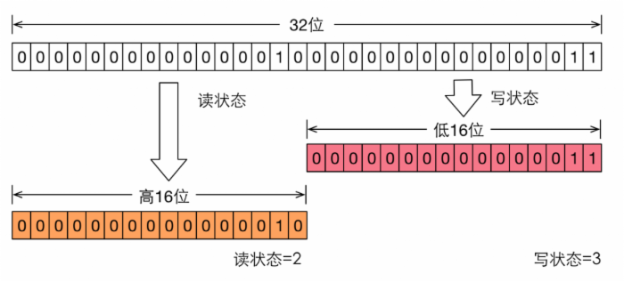

假设当前同步状态值为S，get和set的操作如下：

1. 获取写状态：S&0x0000FFFF:将高16位全部抹去
2. 获取读状态：S>>>16:无符号补0，右移16位
3. 写状态加1： S+1
4. 读状态加1：S+（1<<16）即S + 0x00010000

​	在代码层的判断中，如果S不等于0，当写状态（S&0x0000FFFF），而读状态（S>>>16）大于0，则表示该读写锁的读锁已被获取。

```java
abstract static class Sync extends AbstractQueuedSynchronizer {
    static final int SHARED_SHIFT   = 16;
    // 由于读锁用高位部分，所以读锁个数加1，其实是状态值加 2^16
    static final int SHARED_UNIT    = (1 << SHARED_SHIFT);
    // 写锁的可重入的最大次数、读锁允许的最大数量
    static final int MAX_COUNT      = (1 << SHARED_SHIFT) - 1;
    // 写锁的掩码，用于状态的低16位有效值
    static final int EXCLUSIVE_MASK = (1 << SHARED_SHIFT) - 1;
    // 读锁计数，当前持有读锁的线程数， S>>>16:无符号补0，右移16位
    static int sharedCount(int c)    { return c >>> SHARED_SHIFT; }
    // 写锁的计数，也就是它的重入次数， S&0x0000FFFF:将高16位全部抹去
    static int exclusiveCount(int c) { return c & EXCLUSIVE_MASK; }
    
    /**
     * 每个线程特定的 read 持有计数。存放在ThreadLocal，不需要是线程安全的。
     */
    static final class HoldCounter {
        int count = 0;
        // 使用id而不是引用是为了避免保留垃圾。注意这是个常量。
        final long tid = Thread.currentThread().getId();
    }
    /**
     * 采用继承是为了重写 initialValue 方法，这样就不用进行这样的处理：
     * 如果ThreadLocal没有当前线程的计数，则new一个，再放进ThreadLocal里。
     * 可以直接调用 get。
     * */
    static final class ThreadLocalHoldCounter
        extends ThreadLocal<HoldCounter> {
        public HoldCounter initialValue() {
            return new HoldCounter();
        }
    }
    /**
     * 保存当前线程重入读锁的次数的容器。在读锁重入次数为 0 时移除。
     */
    private transient ThreadLocalHoldCounter readHolds;
    /**
     * 最近一个成功获取读锁的线程的计数。这省却了ThreadLocal查找，
     * 通常情况下，下一个释放线程是最后一个获取线程。这不是 volatile 的，
     * 因为它仅用于试探的，线程进行缓存也是可以的
     * （因为判断是否是当前线程是通过线程id来比较的）。
     */
    private transient HoldCounter cachedHoldCounter;
    /**
     * firstReader是这样一个特殊线程：它是最后一个把 共享计数 从 0 改为 1 的
     * （在锁空闲的时候），而且从那之后还没有释放读锁的。如果不存在则为null。
     * firstReaderHoldCount 是 firstReader 的重入计数。
     *
     * firstReader 不能导致保留垃圾，因此在 tryReleaseShared 里设置为null，
     * 除非线程异常终止，没有释放读锁。
     *
     * 作用是在跟踪无竞争的读锁计数时非常便宜。
     *
     * firstReader及其计数firstReaderHoldCount是不会放入 readHolds 的。
     */
    private transient Thread firstReader = null;
    private transient int firstReaderHoldCount;
    Sync() {
        readHolds = new ThreadLocalHoldCounter();
        setState(getState()); // 确保 readHolds 的内存可见性，利用 volatile 写的内存语义。
    }
}
//公平同步器
static final class FairSync extends Sync {
    private static final long serialVersionUID = -2274990926593161451L;
    final boolean writerShouldBlock() {
        return hasQueuedPredecessors();
    }
    final boolean readerShouldBlock() {
        return hasQueuedPredecessors();
    }
}
//判断队列中是否还有元素，公平锁的特点是，有队列必须排队
public final boolean hasQueuedPredecessors() {
    // The correctness of this depends on head being initialized
    // before tail and on head.next being accurate if the current
    // thread is first in queue.
    Node t = tail; // Read fields in reverse initialization order
    Node h = head;
    Node s;
    return h != t &&
        ((s = h.next) == null || s.thread != Thread.currentThread());
}
//非公平锁
static final class NonfairSync extends Sync {
    private static final long serialVersionUID = -8159625535654395037L;
    final boolean writerShouldBlock() {
        //非公平，写锁不需要等待
        return false; // writers can always barge
    }
    final boolean readerShouldBlock() {
        /* As a heuristic to avoid indefinite writer starvation,
         * block if the thread that momentarily appears to be head
         * of queue, if one exists, is a waiting writer.  This is
         * only a probabilistic effect since a new reader will not
         * block if there is a waiting writer behind other enabled
         * readers that have not yet drained from the queue.
         */
        return apparentlyFirstQueuedIsExclusive();
    }
}
/* 如果头节点的下一个节点是独占线程，为了防止独占线程也就是写线程饥饿等待，
 * 则后入线程应该排队，否则可以闯入
 */
final boolean apparentlyFirstQueuedIsExclusive() {
    Node h, s;
    return (h = head) != null &&
        (s = h.next)  != null &&
        !s.isShared()         &&
        s.thread != null;
}
```

##### 写锁的获取

```java
/**
 * 写锁为0，读锁不为0    或者写锁不为0，且当前线程不是已获取独占锁的线程，锁获取失败。
 * 写锁数量已达到最大值，写锁获取失败。
 * 当前线程应该阻塞，或者设置同步状态state失败，获取锁失败
*/
protected final boolean tryAcquire(int acquires) {
    /*
     * Walkthrough:
     * 1. If read count nonzero or write count nonzero
     *    and owner is a different thread, fail.
     * 2. If count would saturate, fail. (This can only
     *    happen if count is already nonzero.)
     * 3. Otherwise, this thread is eligible for lock if
     *    it is either a reentrant acquire or
     *    queue policy allows it. If so, update state
     *    and set owner.
     */
    Thread current = Thread.currentThread();
    int c = getState();
    int w = exclusiveCount(c);
    if (c != 0) {
        // (Note: if c != 0 and w == 0 then shared count != 0)
        // 1.写锁为0，读锁不为0    或者写锁不为0，且当前线程不是已获取独占锁的线程，锁获取失败
        if (w == 0 || current != getExclusiveOwnerThread())
            return false;
        // 2. 写锁数量已达到最大值，写锁获取失败
        if (w + exclusiveCount(acquires) > MAX_COUNT)
            throw new Error("Maximum lock count exceeded");
        // Reentrant acquire
        setState(c + acquires);
        return true;
    }
    // 3.当前线程应该阻塞，或者设置同步状态state失败，获取锁失败。
    if (writerShouldBlock() ||
        !compareAndSetState(c, c + acquires))
        return false;
    setExclusiveOwnerThread(current);
    return true;
}
```

##### 写锁的释放

```java
protected final boolean tryRelease(int releases) {
    // 如果当前线程不是持有锁的独占线程，抛出异常
    if (!isHeldExclusively())
        throw new IllegalMonitorStateException();
    int nextc = getState() - releases;
    boolean free = exclusiveCount(nextc) == 0;
    // 因为可重入，只有当exclusiveCount(nextc) == 0时候，才会真正释放锁
    if (free)
        setExclusiveOwnerThread(null);
    setState(nextc);
    return free;
}
```

##### 读锁的获取

```java
protected final int tryAcquireShared(int unused) {
    /*
     * Walkthrough:
     * 1. If write lock held by another thread, fail.
     * 2. Otherwise, this thread is eligible for
     *    lock wrt state, so ask if it should block
     *    because of queue policy. If not, try
     *    to grant by CASing state and updating count.
     *    Note that step does not check for reentrant
     *    acquires, which is postponed to full version
     *    to avoid having to check hold count in
     *    the more typical non-reentrant case.
     * 3. If step 2 fails either because thread
     *    apparently not eligible or CAS fails or count
     *    saturated, chain to version with full retry loop.
     */
    Thread current = Thread.currentThread();
    int c = getState();
    // 1.有线程持有写锁，且该线程不是当前线程，获取锁失败，因为存在锁降级
    if (exclusiveCount(c) != 0 &&
        getExclusiveOwnerThread() != current)
        return -1;
    int r = sharedCount(c);
    // 2.如果不应该阻塞，且读锁数<MAX_COUNT且设置同步状态state成功，获取锁成功。
    if (!readerShouldBlock() &&
        r < MAX_COUNT &&
        compareAndSetState(c, c + SHARED_UNIT)) {
        if (r == 0) {
            // 第一次被线程获取
            firstReader = current;
            firstReaderHoldCount = 1;
        } else if (firstReader == current) {
            // 更新首次获取锁线程HoldCount
            firstReaderHoldCount++;
        } else {
            // 更新非首次获取锁线程的HoldCount,先查缓存
            HoldCounter rh = cachedHoldCounter;
            if (rh == null || rh.tid != getThreadId(current))
                // 缓存没有命中，从ThreadLocal中获取
                cachedHoldCounter = rh = readHolds.get();
            else if (rh.count == 0)
                readHolds.set(rh);
            rh.count++;
        }
        return 1;
    }
    // 一次获取读锁失败后，尝试循环获取
    return fullTryAcquireShared(current);
}
final int fullTryAcquireShared(Thread current) {
    /*
     * This code is in part redundant with that in
     * tryAcquireShared but is simpler overall by not
     * complicating tryAcquireShared with interactions between
     * retries and lazily reading hold counts.
     */
    HoldCounter rh = null;
    for (;;) {
        int c = getState();
        /**
         * 如果是其他线程获取了写锁，那么把当前线程阻塞
         * 如果是当前线程获取了写锁，不阻塞，否则会造成死锁
         * 从这里可以看到ReentrantReadWriteLock允许锁降级
         */
        if (exclusiveCount(c) != 0) {
            if (getExclusiveOwnerThread() != current)
                return -1;
            // else we hold the exclusive lock; blocking here
            // would cause deadlock.
        } else if (readerShouldBlock()) {
            /**
             * 进入这里说明，同步队列的头结点的后继有一个竞争写锁的线程
             * 所以这里有一个锁让步的操作，即让写锁先获取
             * 如果是firstReader必然是重入，或者rh.count>0也必然是重入
             * 对于读锁重入是允许死循环直到获取锁成功的，不然会导致死锁
             * 但是如果rh.count = 0就说明，这个线程是第一次获取读锁
             * 为了防止写饥饿，直接将他们重新扔会同步队列，而且这些阻塞不会导致死锁
             */
            // Make sure we're not acquiring read lock reentrantly
            if (firstReader == current) {
                // assert firstReaderHoldCount > 0;
            } else {
                if (rh == null) {
                    rh = cachedHoldCounter;
                    if (rh == null || rh.tid != getThreadId(current)) {
                        rh = readHolds.get();
                        if (rh.count == 0)
                            readHolds.remove();
                    }
                }
                if (rh.count == 0)
                    return -1;
            }
        }
        if (sharedCount(c) == MAX_COUNT)
            throw new Error("Maximum lock count exceeded");
        if (compareAndSetState(c, c + SHARED_UNIT)) {
            if (sharedCount(c) == 0) {
                firstReader = current;
                firstReaderHoldCount = 1;
            } else if (firstReader == current) {
                firstReaderHoldCount++;
            } else {
                if (rh == null)
                    rh = cachedHoldCounter;
                if (rh == null || rh.tid != getThreadId(current))
                    rh = readHolds.get();
                else if (rh.count == 0)
                    readHolds.set(rh);
                rh.count++;
                cachedHoldCounter = rh; // cache for release
            }
            return 1;
        }
    }
}
```

##### 读锁的释放

```java
protected final boolean tryReleaseShared(int unused) {
    // 获取当前线程
    Thread current = Thread.currentThread();
    if (firstReader == current) { // 当前线程为第一个读线程
        // assert firstReaderHoldCount > 0;
        if (firstReaderHoldCount == 1) // 读线程占用的资源数为1
            firstReader = null;
        else // 减少占用的资源
            firstReaderHoldCount--;
    } else { // 当前线程不为第一个读线程
        // 获取缓存的计数器
        HoldCounter rh = cachedHoldCounter;
        if (rh == null || rh.tid != getThreadId(current)) // 计数器为空或者计数器的tid不为当前正在运行的线程的tid
            // 获取当前线程对应的计数器
            rh = readHolds.get();
        // 获取计数
        int count = rh.count;
        if (count <= 1) { // 计数小于等于1
            // 移除
            readHolds.remove();
            if (count <= 0) // 计数小于等于0，抛出异常
                throw unmatchedUnlockException();
        }
        // 减少计数
        --rh.count;
    }
    for (;;) { // 无限循环
        // 获取状态
        int c = getState();
        // 获取状态
        int nextc = c - SHARED_UNIT;
        if (compareAndSetState(c, nextc)) // 比较并进行设置
            // Releasing the read lock has no effect on readers,
            // but it may allow waiting writers to proceed if
            // both read and write locks are now free.
            return nextc == 0;
    }
}
```

##### 总结

​	通过上面的源码分析，我们可以发现一个现象：

​	在线程持有读锁的情况下，该线程不能取得写锁(因为获取写锁的时候，如果发现当前的读锁被占用，就马上获取失败，不管读锁是不是被当前线程持有)。

​	在线程持有写锁的情况下，该线程可以继续获取读锁（获取读锁时如果发现写锁被占用，只有写锁没有被当前线程占用的情况才会获取失败）。

​	仔细想想，这个设计是合理的：因为当线程获取读锁的时候，可能有其他线程同时也在持有读锁，因此不能把获取读锁的线程“升级”为写锁；而对于获得写锁的线程，它一定独占了读写锁，因此可以继续让它获取读锁，当它同时获取了写锁和读锁后，还可以先释放写锁继续持有读锁，这样一个写锁就“降级”为了读锁。

​	综上：一个线程要想同时持有写锁和读锁，必须先获取写锁再获取读锁；写锁可以“降级”为读锁；读锁不能“升级”为写锁。

### ThreadLocal

​	ThreadLoal 变量，线程局部变量，同一个 ThreadLocal 所包含的对象，在不同的 Thread 中有不同的副本。这里有几点需要注意：

- 因为每个 Thread 内有自己的实例副本，且该副本只能由当前 Thread 使用。这是也是 ThreadLocal 命名的由来。
- 既然每个 Thread 有自己的实例副本，且其它 Thread 不可访问，那就不存在多线程间共享的问题。

ThreadLocal 提供了线程本地的实例。它与普通变量的区别在于，每个使用该变量的线程都会初始化一个完全独立的实例副本。ThreadLocal 变量通常被private static修饰。当一个线程结束时，它所使用的所有 ThreadLocal 相对的实例副本都可被回收。

总的来说，ThreadLocal 适用于每个线程需要自己独立的实例且该实例需要在多个方法中被使用，也即变量在线程间隔离而在方法或类间共享的场景。

#### ThreadLocal原理

##### 构造方法

```java
public class ThreadLocal<T> {
    /**
     * ThreadLocals rely on per-thread linear-probe hash maps attached
     * to each thread (Thread.threadLocals and
     * inheritableThreadLocals).  The ThreadLocal objects act as keys,
     * searched via threadLocalHashCode.  This is a custom hash code
     * (useful only within ThreadLocalMaps) that eliminates collisions
     * in the common case where consecutively constructed ThreadLocals
     * are used by the same threads, while remaining well-behaved in
     * less common cases.
     */
    private final int threadLocalHashCode = nextHashCode();

    /**
     * The next hash code to be given out. Updated atomically. Starts at
     * zero.
     */
    private static AtomicInteger nextHashCode =
        new AtomicInteger();

    /**
     * The difference between successively generated hash codes - turns
     * implicit sequential thread-local IDs into near-optimally spread
     * multiplicative hash values for power-of-two-sized tables.
     */
    private static final int HASH_INCREMENT = 0x61c88647;

    /**
     * Returns the next hash code.
     */
    private static int nextHashCode() {
        return nextHashCode.getAndAdd(HASH_INCREMENT);
    }

    /**
     * Returns the current thread's "initial value" for this
     * thread-local variable.  This method will be invoked the first
     * time a thread accesses the variable with the {@link #get}
     * method, unless the thread previously invoked the {@link #set}
     * method, in which case the {@code initialValue} method will not
     * be invoked for the thread.  Normally, this method is invoked at
     * most once per thread, but it may be invoked again in case of
     * subsequent invocations of {@link #remove} followed by {@link #get}.
     *
     * <p>This implementation simply returns {@code null}; if the
     * programmer desires thread-local variables to have an initial
     * value other than {@code null}, {@code ThreadLocal} must be
     * subclassed, and this method overridden.  Typically, an
     * anonymous inner class will be used.
     *
     * @return the initial value for this thread-local
     */
    protected T initialValue() {
        return null;
    }

    /**
     * Creates a thread local variable. The initial value of the variable is
     * determined by invoking the {@code get} method on the {@code Supplier}.
     *
     * @param <S> the type of the thread local's value
     * @param supplier the supplier to be used to determine the initial value
     * @return a new thread local variable
     * @throws NullPointerException if the specified supplier is null
     * @since 1.8
     */
    public static <S> ThreadLocal<S> withInitial(Supplier<? extends S> supplier) {
        return new SuppliedThreadLocal<>(supplier);
    }

    /**
     * Creates a thread local variable.
     * @see #withInitial(java.util.function.Supplier)
     */
    public ThreadLocal() {
    }
}
```

##### set方法

```java
public void set(T value) {
    Thread t = Thread.currentThread();
    ThreadLocalMap map = getMap(t);
    if (map != null)
        map.set(this, value);
    else
        createMap(t, value);
}

void createMap(Thread t, T firstValue) {
    t.threadLocals = new ThreadLocalMap(this, firstValue);
}
```

##### get方法

```java
 public T get() {
     Thread t = Thread.currentThread();
     ThreadLocalMap map = getMap(t);
     if (map != null) {
         ThreadLocalMap.Entry e = map.getEntry(this);
         if (e != null) {
             @SuppressWarnings("unchecked")
             T result = (T)e.value;
             return result;
         }
     }
     return setInitialValue();
 }

 ThreadLocalMap getMap(Thread t) {
     return t.threadLocals;
 }

private T setInitialValue() {
    T value = initialValue();
    Thread t = Thread.currentThread();
    ThreadLocalMap map = getMap(t);
    if (map != null)
        map.set(this, value);
    else
        createMap(t, value);
    return value;
}

```

​	到了这里，我们可以看出，每个Thread里面都有一个ThreadLocal.ThreadLocalMap成员变量，也就是说每个线程通过ThreadLocal.ThreadLocalMap与ThreadLocal相绑定，这样可以确保每个线程访问到的thread-local variable都是本线程的。

##### ThreadLocalMap

​	ThreadLocalMap是线程的私有成员变量。我理解这样做是为了避免多线程竞争，因为放在Thread对象中就相当于线程私有了，处理的时候不需要加锁。由于ThreadLocal本身的设计就是变量不与其他线程共享，不需要其他线程访问本对象的变量，放在Thread对象中不会有问题。

​	Entry是一个以ThreadLocal为key，Object为value的键值对。需要注意的是，threadLocal是弱引用，即使线程正在执行中，只要ThreadLocal对象引用被置成null, Entry的Key就会自动在下一次YGC时被垃圾回收。而在 ThreadLocal使用set()和get()时，又会自动地将那些 key==null 的value置为null，使value能够被垃圾回收，避免内存泄漏。

```java
static class Entry extends WeakReference<ThreadLocal<?>> {
    /** The value associated with this ThreadLocal. */
    Object value;

    Entry(ThreadLocal<?> k, Object v) {
        super(k);
        value = v;
    }
}
```

###### set方法

```java
private void set(ThreadLocal<?> key, Object value) { 
    Entry[] tab = table;
    int len = tab.length;
    // 定位Entry存放的位置
    int i = key.threadLocalHashCode & (len-1);
    // 处理hash冲突的情况，这里采用的是开放地址法
    for (Entry e = tab[i];
         e != null;
         e = tab[i = nextIndex(i, len)]) {
        ThreadLocal<?> k = e.get();
        //更新
        if (k == key) {
            e.value = value;
            return;
        }
        if (k == null) {
            replaceStaleEntry(key, value, i);
            return;
        }
    }
    // 新建entry并插入
    tab[i] = new Entry(key, value);
    int sz = ++size;
    // 清除脏数据，扩容
    if (!cleanSomeSlots(i, sz) && sz >= threshold)
        rehash();
}
```

###### get方法

```java
private Entry getEntry(ThreadLocal<?> key) {
    // 确定entry位置
    int i = key.threadLocalHashCode & (table.length - 1);
    Entry e = table[i];
    // 命中
    if (e != null && e.get() == key)
        return e;
    else
        // 存在hash冲突，继续查找
        return getEntryAfterMiss(key, i, e);
}

private Entry getEntryAfterMiss(ThreadLocal<?> key, int i, Entry e) {
    Entry[] tab = table;
    int len = tab.length;

    while (e != null) {
        ThreadLocal<?> k = e.get();
        //找到entry
        if (k == key)
            return e;
        // 脏数据处理
        if (k == null)
            expungeStaleEntry(i);
        else
            //遍历
            i = nextIndex(i, len);
        e = tab[i];
    }
    return null;
}
```

###### remove方法

```java
private void remove(ThreadLocal<?> key) {
    Entry[] tab = table;
    int len = tab.length;
    int i = key.threadLocalHashCode & (len-1);
    for (Entry e = tab[i];
         e != null;
         e = tab[i = nextIndex(i, len)]) {
        if (e.get() == key) {
            //清空key
            e.clear();
            //清空value
            expungeStaleEntry(i);
            return;
        }
    }
}
```

##### 创建可继承的ThreadLocalMap

```java
static ThreadLocalMap createInheritedMap(ThreadLocalMap parentMap) {
    return new ThreadLocalMap(parentMap);
}

private ThreadLocalMap(ThreadLocalMap parentMap) {
    Entry[] parentTable = parentMap.table;
    int len = parentTable.length;
    setThreshold(len);
    table = new Entry[len];

    for (int j = 0; j < len; j++) {
        Entry e = parentTable[j];
        if (e != null) {
            @SuppressWarnings("unchecked")
            ThreadLocal<Object> key = (ThreadLocal<Object>) e.get();
            if (key != null) {
                Object value = key.childValue(e.value);
                Entry c = new Entry(key, value);
                int h = key.threadLocalHashCode & (len - 1);
                while (table[h] != null)
                    h = nextIndex(h, len);
                table[h] = c;
                size++;
            }
        }
    }
}
```

##### ThreadLocal注意事项

###### 脏数据

线程复用会产生脏数据。由于结程池会重用Thread对象，那么与Thread绑定的类的静态属性ThreadLocal变量也会被重用。如果在实现的线程run()方法体中不显式地调用remove() 清理与线程相关的ThreadLocal信息，那么倘若下一个结程不调用set() 设置初始值，就可能get() 到重用的线程信息，包括 ThreadLocal所关联的线程对象的value值。

###### 内存泄漏

通常我们会使用使用static关键字来修饰ThreadLocal（这也是在源码注释中所推荐的）。在此场景下，其生命周期就不会随着线程结束而结束，寄希望于ThreadLocal对象失去引用后，触发弱引用机制来回收Entry的Value就不现实了。如果不进行remove() 操作，那么这个线程执行完成后，通过ThreadLocal对象持有的对象是不会被释放的。

以上两个问题的解决办法很简单，就是在每次用完ThreadLocal时， 必须要及时调用 remove()方法清理。

###### 父子线程共享线程变量

很多场景下通过ThreadLocal来透传全局上下文，会发现子线程的value和主线程不一致。比如用ThreadLocal来存储监控系统的某个标记位，暂且命名为traceId。某次请求下所有的traceld都是一致的，以获得可以统一解析的日志文件。但在实际开发过程中，发现子线程里的traceld为null，跟主线程的并不一致。这就需要使用InheritableThreadLocal来解决父子线程之间共享线程变量的问题，使整个连接过程中的traceId一致。

### 实现多线程的方法

##### 继承Thread类创建线程

​	Thread类本质上是实现了Runnable接口的一个实例，代表一个线程的实例。启动线程的唯一方法就是通过Thread类的start()实例方法。start()方法是一个native方法，它将启动一个新线程，并执行run()方法。这种方式实现多线程很简单，通过自己的类直接extend Thread，并复写run()方法，就可以启动新线程并执行自己定义的run()方法。例如：

```java
public class MyThread extends Thread {  
　　public void run() {  
　　 System.out.println("MyThread.run()");  
　　}  
}
```

##### 实现Runnable接口创建线程

​	如果自己的类已经extends另一个类，就无法直接extends Thread，此时，可以实现一个Runnable接口，如下：

```java
public class MyThread extends OtherClass implements Runnable {  
　　public void run() {  
　　 System.out.println("MyThread.run()");  
　　}  
}
```

##### 实现Callable接口通过FutureTask包装器来创建Thread线程

```java
public interface Callable<V>   { 
  V call（） throws Exception;   
}
public class SomeCallable<V> extends OtherClass implements Callable<V> {
    @Override
    public V call() throws Exception {
        // TODO Auto-generated method stub
        return null;
    }
}
Callable<V> oneCallable = new SomeCallable<V>();   
//由Callable<Integer>创建一个FutureTask<Integer>对象：   
FutureTask<V> oneTask = new FutureTask<V>(oneCallable);   
//注释：FutureTask<Integer>是一个包装器，它通过接受Callable<Integer>来创建，它同时实现了Future和Runnable接口。 
//由FutureTask<Integer>创建一个Thread对象：   
Thread oneThread = new Thread(oneTask);   
oneThread.start();
```

##### 使用ExecutorService、Callable、Future实现有返回结果的线程

​	ExecutorService、Callable、Future三个接口实际上都是属于Executor框架。返回结果的线程是在JDK1.5中引入的新特征，有了这种特征就不需要再为了得到返回值而大费周折了。而且自己实现了也可能漏洞百出。可返回值的任务必须实现Callable接口。类似的，无返回值的任务必须实现Runnable接口。执行Callable任务后，可以获取一个Future的对象，在该对象上调用get就可以获取到Callable任务返回的Object了。

​	注意：get方法是阻塞的，即：线程无返回结果，get方法会一直等待。再结合线程池接口ExecutorService就可以实现传说中有返回结果的多线程了。

​	下面提供了一个完整的有返回结果的多线程测试例子，在JDK1.5下验证过没问题可以直接使用。代码如下

```java
import java.util.concurrent.*;  
import java.util.Date;  
import java.util.List;  
import java.util.ArrayList;  
  
/** 
* 有返回值的线程 
*/  
@SuppressWarnings("unchecked")  
public class Test {  
public static void main(String[] args) throws ExecutionException,  InterruptedException {  
   System.out.println("----程序开始运行----");  
   Date date1 = new Date();  
  
   int taskSize = 5;  
   // 创建一个线程池  
   ExecutorService pool = Executors.newFixedThreadPool(taskSize);  
   // 创建多个有返回值的任务  
   List<Future> list = new ArrayList<Future>();  
   for (int i = 0; i < taskSize; i++) {  
    Callable c = new MyCallable(i + " ");  
    // 执行任务并获取Future对象  
    Future f = pool.submit(c);  
    // System.out.println(">>>" + f.get().toString());  
    list.add(f);  
   }  
   // 关闭线程池  
   pool.shutdown();  
  
   // 获取所有并发任务的运行结果  
   for (Future f : list) {  
    // 从Future对象上获取任务的返回值，并输出到控制台  
    System.out.println(">>>" + f.get().toString());  
   }  
  
   Date date2 = new Date();  
   System.out.println("----程序结束运行----，程序运行时间【"  
     + (date2.getTime() - date1.getTime()) + "毫秒】");  
}  
}  
  
class MyCallable implements Callable<Object> {  
	private String taskNum;  
  
    MyCallable(String taskNum) {  
       this.taskNum = taskNum;  
    }  

    public Object call() throws Exception {  
       System.out.println(">>>" + taskNum + "任务启动");  
       Date dateTmp1 = new Date();  
       Thread.sleep(1000);  
       Date dateTmp2 = new Date();  
       long time = dateTmp2.getTime() - dateTmp1.getTime();  
       System.out.println(">>>" + taskNum + "任务终止");  
       return taskNum + "任务返回运行结果,当前任务时间【" + time + "毫秒】";  
    }  
}
```

### ThreadPoolExecutor

线程池的优势：

1. 降低创建线程和销毁线程的性能开销
2. 提高响应速度，当有新任务需要执行是不需要等待线程创建就可以立马执行
3. 合理的设置线程池大小可以避免因为线程数超过硬件资源瓶颈带来的问题


#### 构造方法

```java
/**
 * Creates a new {@code ThreadPoolExecutor} with the given initial
 * parameters.
 *
 * @param corePoolSize the number of threads to keep in the pool, even
 *        if they are idle, unless {@code allowCoreThreadTimeOut} is set
 *        核心线程数量
 * @param maximumPoolSize the maximum number of threads to allow in the
 *        pool
 *        最大线程数量（只有当队列满的时候，才会继续创建线程，直到最大线程）
 * @param keepAliveTime when the number of threads is greater than
 *        the core, this is the maximum time that excess idle threads
 *        will wait for new tasks before terminating.
 *        大于核心线程的线程存活时间
 * @param unit the time unit for the {@code keepAliveTime} argument
 *        时间单位
 * @param workQueue the queue to use for holding tasks before they are
 *        executed.  This queue will hold only the {@code Runnable}
 *        tasks submitted by the {@code execute} method.
 *        工作的队列，当核心线程满了的时候放入工作队列
 * @param threadFactory the factory to use when the executor
 *        creates a new thread
 *        线程工厂，创建线程用的
 * @param handler the handler to use when execution is blocked
 *        because the thread bounds and queue capacities are reached
 *        拒绝策略，当线程达到最大线程还不能满足的时候，怎么拒绝处理的策略方式
 * @throws IllegalArgumentException if one of the following holds:<br>
 *         {@code corePoolSize < 0}<br>
 *         {@code keepAliveTime < 0}<br>
 *         {@code maximumPoolSize <= 0}<br>
 *         {@code maximumPoolSize < corePoolSize}
 * @throws NullPointerException if {@code workQueue}
 *         or {@code threadFactory} or {@code handler} is null
 */
public ThreadPoolExecutor(int corePoolSize,
                              int maximumPoolSize,
                              long keepAliveTime,
                              TimeUnit unit,
                              BlockingQueue<Runnable> workQueue,
                              ThreadFactory threadFactory,
                              RejectedExecutionHandler handler) {
    if (corePoolSize < 0 ||
        maximumPoolSize <= 0 ||
        maximumPoolSize < corePoolSize ||
        keepAliveTime < 0)
        throw new IllegalArgumentException();
    if (workQueue == null || threadFactory == null || handler == null)
        throw new NullPointerException();
    this.acc = System.getSecurityManager() == null ?
        null :
    AccessController.getContext();
    this.corePoolSize = corePoolSize;
    this.maximumPoolSize = maximumPoolSize;
    this.workQueue = workQueue;
    this.keepAliveTime = unit.toNanos(keepAliveTime);
    this.threadFactory = threadFactory;
    this.handler = handler;
}
```

#### execute方法

``` java
public void execute(Runnable command) {
    if (command == null)
        throw new NullPointerException();
    /*
     * Proceed in 3 steps:
     *
     * 1. If fewer than corePoolSize threads are running, try to
     * start a new thread with the given command as its first
     * task.  The call to addWorker atomically checks runState and
     * workerCount, and so prevents false alarms that would add
     * threads when it shouldn't, by returning false.
     *
     * 2. If a task can be successfully queued, then we still need
     * to double-check whether we should have added a thread
     * (because existing ones died since last checking) or that
     * the pool shut down since entry into this method. So we
     * recheck state and if necessary roll back the enqueuing if
     * stopped, or start a new thread if there are none.
     *
     * 3. If we cannot queue task, then we try to add a new
     * thread.  If it fails, we know we are shut down or saturated
     * and so reject the task.
     */
    int c = ctl.get();
    if (workerCountOf(c) < corePoolSize) {
        if (addWorker(command, true))
            return;
        c = ctl.get();
    }
    if (isRunning(c) && workQueue.offer(command)) {
        int recheck = ctl.get();
        if (! isRunning(recheck) && remove(command))
            reject(command);
        else if (workerCountOf(recheck) == 0)
            addWorker(null, false);
    }
    else if (!addWorker(command, false))
        reject(command);
}
```

#### ctl 的作用

​	它是一个原子类，主要作用是用来保存线程数量和线程池的状态。我们来分析一下这段代码，其实比较有意思，他用到了位运算。一个 int 数值是 32 个 bit 位，这里采用高 3 位来保存运行状态，低 29 位来保存线程数量。我们来分析默认情况下，也就是 ctlOf(RUNNING)运行状态，调用了 ctlOf(int rs,int wc)方法。
​	其中 RUNNING =-1 << COUNT_BITS ； -1 左移 29 位. -1 的二进制是32 个 1（1111 1111 1111 1111 1111 1111 1111 1111），-1 的二进制计算方法 原码是 1000…001 . 高位 1 表示符号位。 然后对原码取反，高位不变得到 1111…110 然后对反码进行+1 ，也就是补码操作， 最后得到 1111…1111，那么-1 <<左移 29 位， 也就是 【111】 表示； rs | wc 。二进制的 111 | 000 。得到的结果仍然是 111 那么同理可得其他的状态的 bit 位表示。

```java
private static final int COUNT_BITS = Integer.SIZE - 3; //32-3
private static final int CAPACITY = (1 << COUNT_BITS) - 1; //将 1 的二进制向右位移 29 位,再减 1 表示最大线程容量
//运行状态保存在 int 值的高 3 位 (所有数值左移 29 位)
private static final int RUNNING = -1 << COUNT_BITS;// 接收新任务,并执行队列中的任务
private static final int SHUTDOWN = 0 << COUNT_BITS;// 不接收新任务,但是执行队列中的任务
private static final int STOP = 1 << COUNT_BITS;// 不接收新任务,不执行队列中的任务,中断正在执行中的任务
private static final int TIDYING = 2 << COUNT_BITS; //所有的任务都已结束,线程数量为 0,处于该状态的线程池即将调用 terminated()方法
private static final int TERMINATED = 3 << COUNT_BITS;// terminated()方法执行完成
```

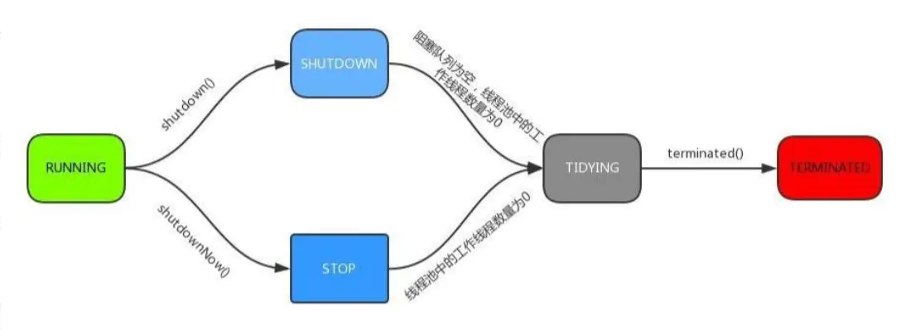

#### addWorker

如果工作线程数小于核心线程数的话，会调用 addWorker，顾名思义，其实就是要创建一个工作线程。我们来看看源码的实现
 源码比较长，其实就做了两件事。

- 才用循环 CAS 操作来将线程数加 1；
- 新建一个线程并启用。

```java
private boolean addWorker(Runnable firstTask, boolean core) {
    retry: //goto 语句,避免死循环
    for (;;) {
        int c = ctl.get();
        int rs = runStateOf(c);
        // Check if queue empty only if necessary.
        /*如果线程处于非运行状态，并且 rs 不等于 SHUTDOWN 且 firstTask 不等于空且且
        workQueue 为空，直接返回 false（表示不可添加 work 状态）
        1. 线程池已经 shutdown 后，还要添加新的任务，拒绝
        2. （第二个判断）SHUTDOWN 状态不接受新任务，但仍然会执行已经加入任务队列的任
        务，所以当进入 SHUTDOWN 状态，而传进来的任务为空，并且任务队列不为空的时候，是允许添加
        新线程的,如果把这个条件取反，就表示不允许添加 worker*/
        if (rs >= SHUTDOWN &&
                ! (rs == SHUTDOWN &&
                        firstTask == null &&
                        ! workQueue.isEmpty()))
            return false;
        for (;;) { //自旋
            int wc = workerCountOf(c);//获得 Worker 工作线程数
            //如果工作线程数大于默认容量大小或者大于核心线程数大小，则直接返回 false 表示不
            能再添加 worker。
            if (wc >= CAPACITY ||
                    wc >= (core ? corePoolSize : maximumPoolSize))
                return false;
            if (compareAndIncrementWorkerCount(c))//通过 cas 来增加工作线程数，如果 cas 失败，则直接重试
                break retry;
            c = ctl.get(); // Re-read ctl //再次获取 ctl 的值
            if (runStateOf(c) != rs) //这里如果不想等，说明线程的状态发生了变化，继续重试
                continue retry;
            // else CAS failed due to workerCount change; retry inner loop
        }
    }

    
    //上面这段代码主要是对 worker 数量做原子+1 操作,下面的逻辑才是正式构建一个 worker
    boolean workerStarted = false; //工作线程是否启动的标识
    boolean workerAdded = false; //工作线程是否已经添加成功的标识
    Worker w = null;
    try {
        w = new Worker(firstTask); //构建一个 Worker，这个 worker 是什么呢？我们可以看到构造方法里面传入了一个 Runnable 对象
        final Thread t = w.thread; //从 worker 对象中取出线程
        if (t != null) {
            final ReentrantLock mainLock = this.mainLock;
            mainLock.lock(); //这里有个重入锁，避免并发问题
            try {
                // Recheck while holding lock.
                // Back out on ThreadFactory failure or if
                // shut down before lock acquired.
                int rs = runStateOf(ctl.get());
                //只有当前线程池是正在运行状态，[或是 SHUTDOWN 且 firstTask 为空]，才能添加到 workers 集合中
                if (rs < SHUTDOWN ||
                        (rs == SHUTDOWN && firstTask == null)) {
                    //任务刚封装到 work 里面，还没 start,你封装的线程就是 alive，几个意思？肯定是要抛异常出去的
                    if (t.isAlive()) // precheck that t is startable
                        throw new IllegalThreadStateException();
                    workers.add(w); //将新创建的 Worker 添加到 workers 集合中
                    int s = workers.size();
                    //如果集合中的工作线程数大于最大线程数，这个最大线程数表示线程池曾经出现过的最大线程数
                    if (s > largestPoolSize)
                        largestPoolSize = s; //更新线程池出现过的最大线程数
                    workerAdded = true;//表示工作线程创建成功了
                }
            } finally {
                mainLock.unlock(); //释放锁
            }
            if (workerAdded) {//如果 worker 添加成功
                t.start();//启动线程
                workerStarted = true;
            }
        }
    } finally {
        if (! workerStarted)
            addWorkerFailed(w); //如果添加失败，就需要做一件事，就是递减实际工作线程数(还记得我们最开始的时候增加了工作线程数吗)
    }
    return workerStarted;//返回结果
}

private final class Worker extends AbstractQueuedSynchronizer implements Runnable {
    private static final long serialVersionUID = 6138294804551838833L;
    /**
     * Thread this worker is running in. Null if factory fails.
     */
    final Thread thread; //注意了，这才是真正执行 task 的线程，从构造函数可知是由ThreadFactury 创建的
    /**
     * Initial task to run. Possibly null.
     */
    Runnable firstTask; //这就是需要执行的 task
    /**
     * Per-thread task counter
     */
    volatile long completedTasks; //完成的任务数，用于线程池统计

    Worker(Runnable firstTask) {
        setState(-1); //初始状态 -1,防止在调用 runWorker()，也就是真正执行 task前中断 thread。
        this.firstTask = firstTask;
        this.thread = getThreadFactory().newThread(this);
    }

    public void run() {
        runWorker(this);
    }

    ...
}
```

1. 每个 worker,都是一条线程,同时里面包含了一个 firstTask,即初始化时要被首先执行的任务.
2. 最终执行任务的,是 runWorker()方法

​	Worker 类继承了 AQS，并实现了 Runnable 接口，注意其中的 firstTask 和 thread 属性：
 firstTask 用它来保存传入的任务；thread 是在调用构造方法时通过 ThreadFactory 来创建的线程，是用来处理任务的线程。

​	在调用构造方法时，需要传入任务，这里通过 getThreadFactory().newThread(this);来新建一个线程，newThread 方法传入的参数是 this，因为 Worker 本身继承了 Runnable 接口，也就是一个线程，所以一个 Worker 对象在启动的时候会调用 Worker 类中的 run 方法。

​	Worker 继承了 AQS，使用 AQS 来实现独占锁的功能。为什么不使用 ReentrantLock 来实现呢？可以看到 tryAcquire 方法，它是不允许重入的，而 ReentrantLock 是允许重入的：

​	lock 方法一旦获取了独占锁，表示当前线程正在执行任务中；那么它会有以下几个作用

1. 如果正在执行任务，则不应该中断线程；
2. 如果该线程现在不是独占锁的状态，也就是空闲的状态，说明它没有在处理任务，这时可以对该线程进行中断；
3. 线程池在执行 shutdown 方法或 tryTerminate 方法时会调用 interruptIdleWorkers 方法来中断空闲的线程，interruptIdleWorkers 方法会使用 tryLock 方法来判断线程池中的线程是否是空闲状态
4. 之所以设置为不可重入，是因为我们不希望任务在调用像 setCorePoolSize 这样的线程池控制方法时重新获取锁，这样会中断正在运行的线程

#### addWorkerFailed

```java
private void addWorkerFailed(Worker w) {
    final ReentrantLock mainLock = this.mainLock;
    mainLock.lock();
    try {
        if (w != null)
            workers.remove(w);
        decrementWorkerCount();
        tryTerminate();
    } finally {
        mainLock.unlock();
    }
}
```

这个方法主要做两件事

1. 如果 worker 已经构造好了，则从 workers 集合中移除这个 worker
2. 原子递减核心线程数（因为在 addWorker 方法中先做了原子增加）
3. 尝试结束线程池

#### runWorker 方法

​	前面已经了解了 ThreadPoolExecutor 的核心方法 addWorker，主要作用是增加工作线程，而 Worker 简单理解其实就是一个线程，里面重新了 run 方法，这块是线程池中执行任务的真正处理逻辑，也就是 runWorker 方法，这个方法主要做几件事

1. 如果 task 不为空,则开始执行 task
2. 如果 task 为空,则通过 getTask()再去取任务,并赋值给 task,如果取到的 Runnable 不为空,则执行该任务
3. 执行完毕后,通过 while 循环继续 getTask()取任务
4. 如果 getTask()取到的任务依然是空,那么整个 runWorker()方法执行完毕

```java
final void runWorker(Worker w) {
    Thread wt = Thread.currentThread();
    Runnable task = w.firstTask;
    w.firstTask = null;
    //unlock，表示当前 worker 线程允许中断，因为 new Worker 默认的 state=-1,此处是调用
    //Worker 类的 tryRelease()方法，将 state 置为 0，
    //而 interruptIfStarted()中只有 state>=0 才允许调用中断
    w.unlock(); // allow interrupts
    boolean completedAbruptly = true;
    try {
        //注意这个 while 循环,在这里实现了 [线程复用] // 如果 task 为空，则通过getTask 来获取任务
        while (task != null || (task = getTask()) != null) {
            w.lock(); //上锁，不是为了防止并发执行任务，为了在 shutdown()时不终止正在运行的 worker
            //线程池为 stop 状态时不接受新任务，不执行已经加入任务队列的任务，还中断正在执行的任务
            //所以对于 stop 状态以上是要中断线程的
            //(Thread.interrupted() &&runStateAtLeast(ctl.get(), STOP)确保线程中断标志位为 true 且是 stop 状态以上，接着清除了中断标志
            //!wt.isInterrupted()则再一次检查保证线程需要设置中断标志位
            if ((runStateAtLeast(ctl.get(), STOP) ||
                    (Thread.interrupted() &&
                            runStateAtLeast(ctl.get(), STOP))) &&
                    !wt.isInterrupted())
                wt.interrupt();
            try {
                beforeExecute(wt, task);//这里默认是没有实现的，在一些特定的场景中我们可以自己继承 ThreadpoolExecutor 自己重写
                Throwable thrown = null;
                try {
                    task.run(); //执行任务中的 run 方法
                } catch (RuntimeException x) {
                    thrown = x; throw x;
                } catch (Error x) {
                    thrown = x; throw x;
                } catch (Throwable x) {
                    thrown = x; throw new Error(x);
                } finally {
                    afterExecute(task, thrown); //这里默认默认而也是没有实现
                }
            } finally {
                //置空任务(这样下次循环开始时,task 依然为 null,需要再通过 getTask()取) + 记录该 Worker 完成任务数量 + 解锁
                task = null;
                w.completedTasks++;
                w.unlock();
            }
        }
        completedAbruptly = false;
    } finally {
        processWorkerExit(w, completedAbruptly);
        //1.将入参 worker 从数组 workers 里删除掉；
        //2.根据布尔值 allowCoreThreadTimeOut 来决定是否补充新的 Worker 进数组workers
    }
}
```

#### getTask

```java
private Runnable getTask() {
    boolean timedOut = false; // Did the last poll() time out?
    for (;;) {//自旋
        int c = ctl.get();
        int rs = runStateOf(c);
        /* 对线程池状态的判断，两种情况会 workerCount-1，并且返回 null
        1. 线程池状态为 shutdown，且 workQueue 为空（反映了 shutdown 状态的线程池还是要执行 workQueue 中剩余的任务的）
        2. 线程池状态为 stop（shutdownNow()会导致变成 STOP）（此时不用考虑 workQueue的情况）*/
        // Check if queue empty only if necessary.
        if (rs >= SHUTDOWN && (rs >= STOP || workQueue.isEmpty())) {
            decrementWorkerCount();
            return null;//返回 null，则当前 worker 线程会退出
        }
        int wc = workerCountOf(c);
        // timed 变量用于判断是否需要进行超时控制。
        // allowCoreThreadTimeOut 默认是 false，也就是核心线程不允许进行超时；
        // wc > corePoolSize，表示当前线程池中的线程数量大于核心线程数量；
        // 对于超过核心线程数量的这些线程，需要进行超时控制
        boolean timed = allowCoreThreadTimeOut || wc > corePoolSize;
        /*1. 线程数量超过 maximumPoolSize 可能是线程池在运行时被调用了 setMaximumPoolSize()
        被改变了大小，否则已经 addWorker()成功不会超过 maximumPoolSize
        2. timed && timedOut 如果为 true，表示当前操作需要进行超时控制，并且上次从阻塞队列中
        获取任务发生了超时.其实就是体现了空闲线程的存活时间*/
        if ((wc > maximumPoolSize || (timed && timedOut))
                && (wc > 1 || workQueue.isEmpty())) {
            if (compareAndDecrementWorkerCount(c))
                return null;
            continue;
        }
        try {
            /*根据 timed 来判断，如果为 true，则通过阻塞队列 poll 方法进行超时控制，如果在
            keepaliveTime 时间内没有获取到任务，则返回 null.
            否则通过 take 方法阻塞式获取队列中的任务*/
            Runnable r = timed ?
                    workQueue.poll(keepAliveTime, TimeUnit.NANOSECONDS) :
                    workQueue.take();
            if (r != null)//如果拿到的任务不为空，则直接返回给 worker 进行处理
                return r;
            timedOut = true;//如果 r==null，说明已经超时了，设置 timedOut=true，在下次自旋的时候进行回收
        } catch (InterruptedException retry) {
            timedOut = false;// 如果获取任务时当前线程发生了中断，则设置 timedOut 为false 并返回循环重试
        }
    }
}
```

#### 线程池的注意事项
​	分析完线程池以后，我们再来了解一下线程池的注意事项

​	阿里开发手册不建议使用线程池,手册上是说线程池的构建不允许使用 Executors 去创建，而是通过 ThreadPoolExecutor 的方式。
​	分析完原理以后，大家自己一定要有一个答案。我来简单分析下，用 Executors 使得用户不需要关心线程池的参数配置，意味着大家对于线程池的运行规则也会慢慢的忽略。这会导致一个问题，比如我们用 newFixdThreadPool 或者 singleThreadPool.允许的队列长度为Integer.MAX_VALUE，如果使用不当会导致大量请求堆积到队列中导致 OOM 的风险而 newCachedThreadPool，允许创建线程数量为 Integer.MAX_VALUE，也可能会导致大量线程的创建出现 CPU 使用过高或者 OOM 的问题。而如果我们通过 ThreadPoolExecutor 来构造线程池的话，我们势必要了解线程池构造中每个参数的具体含义，使得开发者在配置参数的时候能够更加谨慎。

#### 如何合理配置线程池的大小
​	如何合理配置线程池大小，线程池大小不是靠猜，也不是说越多越好。
​	在遇到这类问题时，先冷静下来分析。需要分析线程池执行的任务的特性： CPU 密集型还是 IO 密集型
每个任务执行的平均时长大概是多少，这个任务的执行时长可能还跟任务处理逻辑是否涉及到网络传输以及底层系统资源依赖有关系。

​	如果是 CPU 密集型，主要是执行计算任务，响应时间很快，cpu 一直在运行，这种任务 cpu的利用率很高，那么线程数的配置应该根据 CPU 核心数来决定，CPU 核心数=最大同时执行线程数，加入 CPU 核心数为 4，那么服务器最多能同时执行 4 个线程。过多的线程会导致上下文切换反而使得效率降低。那线程池的最大线程数可以配置为 cpu 核心数+1。

​	如果是 IO 密集型，主要是进行 IO 操作，执行 IO 操作的时间较长，这是 cpu 出于空闲状态，导致 cpu 的利用率不高，这种情况下可以增加线程池的大小。这种情况下可以结合线程的等待时长来做判断，等待时间越高，那么线程数也相对越多。一般可以配置 cpu 核心数的 2 倍。

​	一个公式：线程池设定最佳线程数目 = ((线程池设定的线程等待时间+线程 CPU 时间)/线程 CPU 时间)* CPU 数目

​	这个公式的线程 cpu 时间是预估的程序单个线程在 cpu 上运行的时间（通常使用 loadrunner测试大量运行次数求出平均值）

#### 线程池的关闭
​	ThreadPoolExecutor 提 供 了 两 个 方 法 ， 用 于 线 程 池 的 关 闭 ， 分 别 是 shutdown() 和shutdownNow()，其中：shutdown()：不会立即终止线程池，而是要等所有任务缓存队列中的任务都执行完后才终止，但再也不会接受新的任务 shutdownNow()：立即终止线程池，并尝试打断正在执行的任务，并且清空任务缓存队列，返回尚未执行的任务

#### 线程池容量的动态调整
​	ThreadPoolExecutor 提 供 了 动 态 调 整 线 程 池 容 量 大 小 的 方 法 ： setCorePoolSize() 和
setMaximumPoolSize()，setCorePoolSize：设置核心池大小 setMaximumPoolSize：设置线程池最大能创建的线程数目大小

#### 任务缓存队列及排队策略
​	在前面我们提到了任务缓存队列，即 workQueue，它用来存放等待执行的任务。
​	workQueue 的类型为 BlockingQueue，通常可以取下面三种类型：

​	ArrayBlockingQueue：基于数组的先进先出队列，此队列创建时必须指定大小；
​	LinkedBlockingQueue：基于链表的先进先出队列，如果创建时没有指定此队列大小，则默认为 Integer.MAX_VALUE；
​	SynchronousQueue：这个队列比较特殊，它不会保存提交的任务，而是将直接新建一个线程来执行新来的任务。

## JAVA8 新特性

